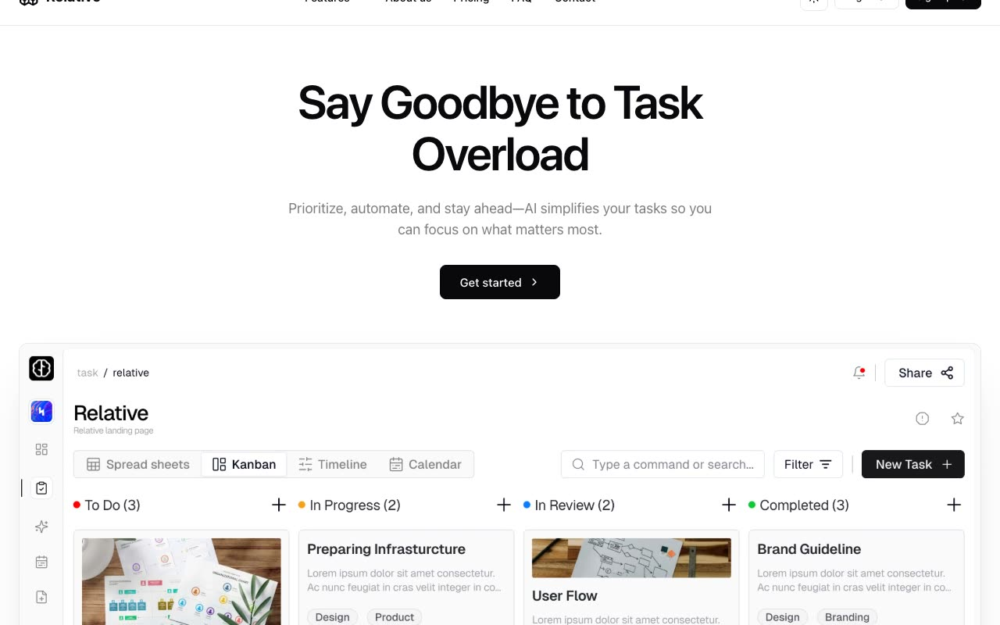

# Relative — SaaS Productivity Marketing Template Clone (Vanilla HTML/CSS/JS, shadcn/ui tokens)

[](./demo.mp4)

A pixel-faithful, same-to-same clone of **Relative**, a premium multi-page SaaS productivity-app marketing template (originally a Next.js + shadcn/ui + Tailwind design sold on shadcnblocks.com), rebuilt here as plain static HTML, CSS, and vanilla JavaScript with all assets vendored locally and no build step. It reproduces nine pages — home, about, pricing, FAQ, contact, login, signup, terms of service, and a 404 — with light and dark mode driven by shadcn/ui design tokens, a localStorage-persisted theme toggle, a Features dropdown mega-menu, an FAQ accordion, a pricing monthly/yearly toggle, and IntersectionObserver scroll-reveal animations. Built with vanilla HTML/CSS/JS and shadcn/ui CSS variables. Generated with Claude Fable 5.

## Run

This is a static site with no build step. Serve the folder over HTTP and open the home page:

```sh
python3 -m http.server 8000
```

Then visit <http://localhost:8000/index.html>.

The other pages are reachable at `about.html`, `pricing.html`, `faq.html`, `contact.html`, `login.html`, `signup.html`, `terms-of-service.html`, `dashboard.html`, and `404.html`.

## Notes

- **Theme toggle** — the sun/moon button switches between light and dark mode by toggling the `.dark` class; the choice is persisted in `localStorage` so it survives reloads. The entire site recolors through shadcn/ui HSL token variables.
- **Interactions** — a Features dropdown mega-menu, an FAQ accordion, a pricing monthly/yearly toggle, and subtle fade/slide-up entrance animations on scroll via `IntersectionObserver`.
- **Assets** — every image, logo, and avatar is vendored under `assets/` and referenced by local path; there are no remote URLs at runtime.
- `prompt.md` holds the full build spec (palette, fonts, radii, per-page layout) and `demo.mp4` shows the template in motion.

## Credits

Faithful clone of an existing design, recreated for study/learning. All credit for the original design goes to its creators.

**Original:** Relative template on shadcnblocks.com — <https://www.shadcnblocks.com/template/relative>

---

Part of the [Templates](../../../) collection in the [claude-directory](../../../../) — an open-source gallery of AI-generated UI built with Claude Fable 5. [Browse the live gallery](https://pulkitxm.com/claude-directory).
