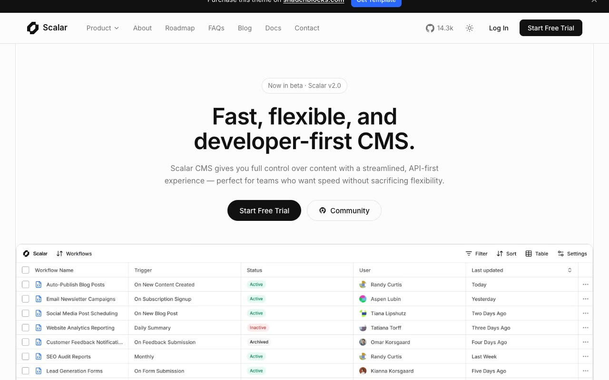

# Scalar — shadcn/ui CMS Marketing + Docs Website Template Clone (Static HTML/CSS/JS)

[](./demo.mp4)

Scalar is a self-contained, no-build clone of the shadcn/ui "Scalar" template — a developer-first headless CMS marketing and documentation website. It spans 29 pages (home, about, roadmap, FAQ, a blog index with 8 posts, a Fumadocs-style docs overview with 10 doc pages, contact, login, signup, privacy policy, and terms of service), all sharing a sticky header, promo bar, open-source-vs-cloud CTA, and footer. The design uses a monochrome OKLCH neutral palette with a single blue accent, Inter and IBM Plex Mono type, IntersectionObserver fade/rise reveals, accordions, and a working light/dark theme toggle persisted to localStorage. Built with plain HTML, CSS, and vanilla JavaScript — no build step, fully offline. Generated with Claude Fable 5.

## Run

No build step and no dependencies — just serve the folder over HTTP and open `index.html`:

```sh
python3 -m http.server 8000
# then open http://localhost:8000/index.html
```

Opening `index.html` directly from the filesystem also works for most pages, but a local server is recommended so relative links and assets resolve correctly across the docs and blog subfolders.

The light/dark theme toggle (sun/moon icon in the header) writes the chosen mode to `localStorage` under the `scalar-theme` key, so the preference persists across pages and reloads.

`prompt.md` holds the full build spec, and `demo.mp4` shows the template in motion.

## Credits

Faithful clone of an existing design, recreated for study/learning. All credit for the original design goes to its creators.

**Original:** Scalar template on shadcnblocks.com — <https://www.shadcnblocks.com/template/scalar>

---

Part of the [Templates](../../../) collection in the [claude-directory](../../../../) — an open-source gallery of AI-generated UI built with Claude Fable 5. [Browse the live gallery](https://pulkitxm.com/claude-directory).
