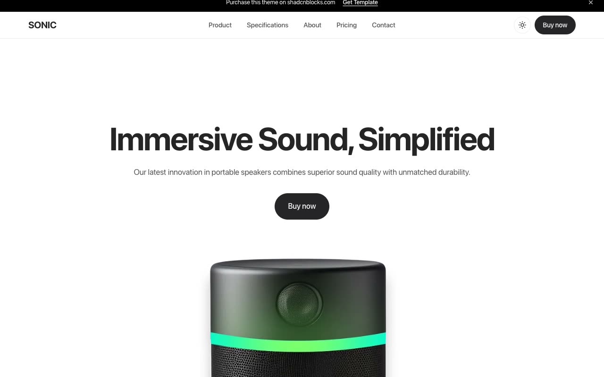

# Sonic — Premium Speaker / Audio Product Website Template Clone (Vanilla HTML/CSS/JS)

[](./demo.mp4)

Sonic is a faithful, same-to-same clone of the shadcnblocks "Sonic" premium Next.js speaker/audio product template, rebuilt as a self-contained static site with no build step. It is a minimal, monochrome product-marketing website for a premium portable speaker — typography-led on a black/white/grey palette with the SF Pro Display typeface, large centered headlines, rounded product photography, and pill buttons. The clone reproduces all 15 pages (home, product, specifications, about, pricing, contact, blog index, six blog posts, terms of service, privacy policy), a light/dark theme toggle with a circular view-transition mask, a sticky header with a slide-in mobile drawer, a dismissible promo banner, a FAQ accordion, and IntersectionObserver scroll-reveal animations. Built with plain HTML, CSS, and vanilla JavaScript; all assets (the SF Pro Display font and product/blog images) are vendored locally under `assets/`, so it runs fully offline. Generated with Claude Fable 5.

## Run

There is no build step. Serve the folder statically and open `index.html`:

```sh
python3 -m http.server
# then open http://localhost:8000/index.html
```

Any static file server works. Opening `index.html` directly via `file://` also mostly works, but serving over HTTP is recommended so the vendored fonts and images load reliably.

## Notes

- **Theme toggle** — `app.js` toggles a `dark` class on `<html>`, persists the choice to `localStorage` (`sonic-theme`), and animates a circular `clip-path` view transition expanding from the toggle when the browser supports `document.startViewTransition` (it falls back to an instant switch otherwise, and respects `prefers-reduced-motion`).
- **Mobile drawer** — the hamburger toggles a `menu-open` body class for the slide-in drawer; it closes on link click, backdrop click, or `Escape`.
- **Promo banner** — dismissal is remembered for the session via `sessionStorage` (`sonic-promo`).
- **FAQ accordion** — single-open behavior within each list.
- **Scroll reveal** — `.reveal` elements fade/scale in via an `IntersectionObserver`, with a failsafe that un-hides anything still hidden shortly after load.
- `prompt.md` holds the full build spec (palette tokens, typography, per-page layout), and `demo.mp4` shows the template in motion.

## Credits

Faithful clone of an existing design, recreated for study/learning. All credit for the original design goes to its creators.

**Original:** Sonic — a premium template by shadcnblocks — <https://www.shadcnblocks.com/template/sonic>

---

Part of the [shadcnblocks](../) premium templates in the [Templates](../../../) collection of the [claude-directory](../../../../) — an open-source gallery of AI-generated UI built with Claude Fable 5. [Browse the live gallery](https://pulkitxm.com/claude-directory).
