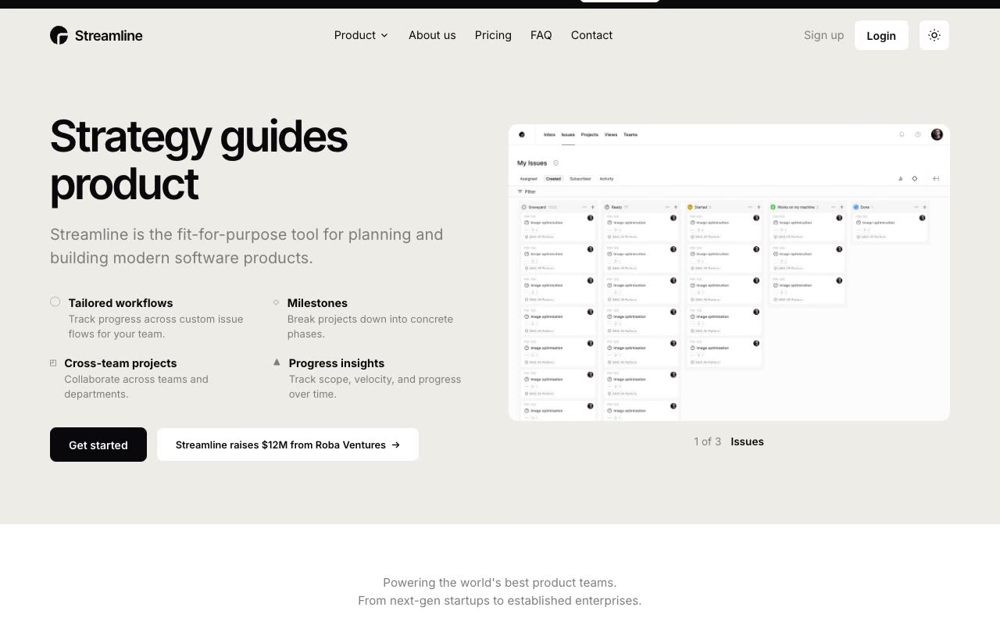

# Streamline — SaaS Landing Page Template Clone (Vanilla HTML/CSS/JS)

[](./demo.mp4)

A pixel-faithful, self-contained clone of the **Streamline** SaaS landing-page template by shadcnblocks — rebuilt in plain HTML, CSS, and vanilla JavaScript with no build step and all assets vendored locally. It reproduces the original's warm-neutral editorial aesthetic (Inter Tight display headings on an `#EEECE7` hero, near-black dark CTA) across 11 pages — home, about, pricing, contact, FAQ, login, signup, terms, privacy, and a 404 (also served at `get-started` and `customer-stories`) — and is fully theme-dependent (light + dark) with a working header theme toggle that persists to `localStorage` and honors `prefers-color-scheme`. Interactions are recreated faithfully: accordions, hero and testimonial carousels, feature tabs, a pricing billed-annually toggle, an announcement-bar dismiss, a product nav dropdown, and IntersectionObserver scroll-reveal entrance animations. Generated with Claude Fable 5.

## Run

No build step. Serve the folder with any static server and open `index.html`:

```sh
python3 -m http.server
# then open http://localhost:8000/index.html
```

Theme is driven by HSL CSS custom properties; the header toggle switches light/dark and persists the choice to `localStorage`.

The full build spec lives in `prompt.md`, and `demo.mp4` shows the template in motion.

## Credits

Faithful clone of an existing design, recreated for study/learning. All credit for the original design goes to its creators.

**Original:** Streamline by shadcnblocks — <https://www.shadcnblocks.com/template/streamline>

---

Part of the [Templates](../) collection in the [claude-directory](../../../) — an open-source gallery of AI-generated UI built with Claude Fable 5. [Browse the live gallery](https://pulkitxm.com/claude-directory).
