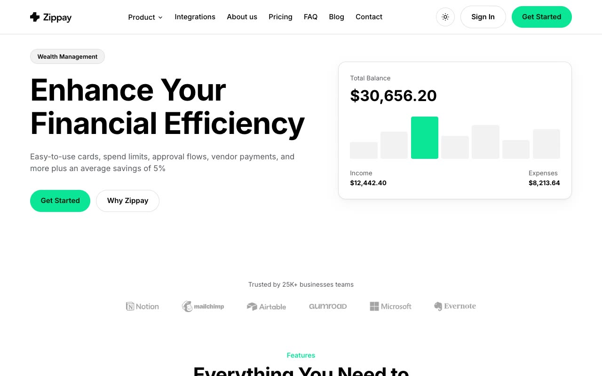

# Zippay — Fintech / Spend-Management SaaS Marketing Template Clone (Vanilla HTML/CSS/JS, No Build)

[](./demo.mp4)

A self-contained, faithful clone of the **Zippay** fintech / spend-management SaaS marketing template from shadcnblocks, rebuilt as plain HTML, CSS, and vanilla JavaScript with no build step. The 13-page site pairs a crisp white/light-gray canvas with an emerald-green brand accent and deep forest-green hero, CTA, and footer panels, and ships a sticky shared header with a Product dropdown and theme toggle, a repeated "a better way to manage your money" CTA band, a four-column footer, light + dark mode (CSS custom properties persisted via `localStorage` and honoring `prefers-color-scheme`), scroll-reveal entrance animations, hover lift states, and an FAQ / plan-comparison accordion. Built with Inter typography, CSS custom-property theme tokens, and locally vendored assets (images, icons, fonts) under `assets/`. Generated with Claude Fable 5.

## Pages (13)

`index` (home), `about`, `feature1`, `feature2`, `integrations`, `pricing`, `faq`, `contact`, `login`, `signup`, `blog`, `privacy`, `terms`.

## Stack

- Plain HTML + CSS + vanilla JavaScript, no build tooling.
- `css/tokens.css` — light/dark theme tokens as CSS custom properties; `css/styles.css` — layout and components.
- `js/main.js` — theme toggle + persistence, Product dropdown, mobile menu, scroll-reveal, accordions.
- Assets vendored locally under `assets/` (images, icons, favicon, fonts).

## Run

No build step. Serve the folder statically and open `index.html`:

```sh
python3 -m http.server
```

Then visit the printed local URL (e.g. `http://localhost:8000`).

`prompt.md` holds the full build spec, and `demo.mp4` shows the template in motion.

## Credits

Faithful clone of an existing design, recreated for study/learning. All credit for the original design goes to its creators.

**Original:** shadcnblocks — Zippay template — <https://www.shadcnblocks.com/template/zippay>

---

Part of the [Templates](../) collection in the [claude-directory](../../) — an open-source gallery of AI-generated UI built with Claude Fable 5. [Browse the live gallery](https://pulkitxm.com/claude-directory).
