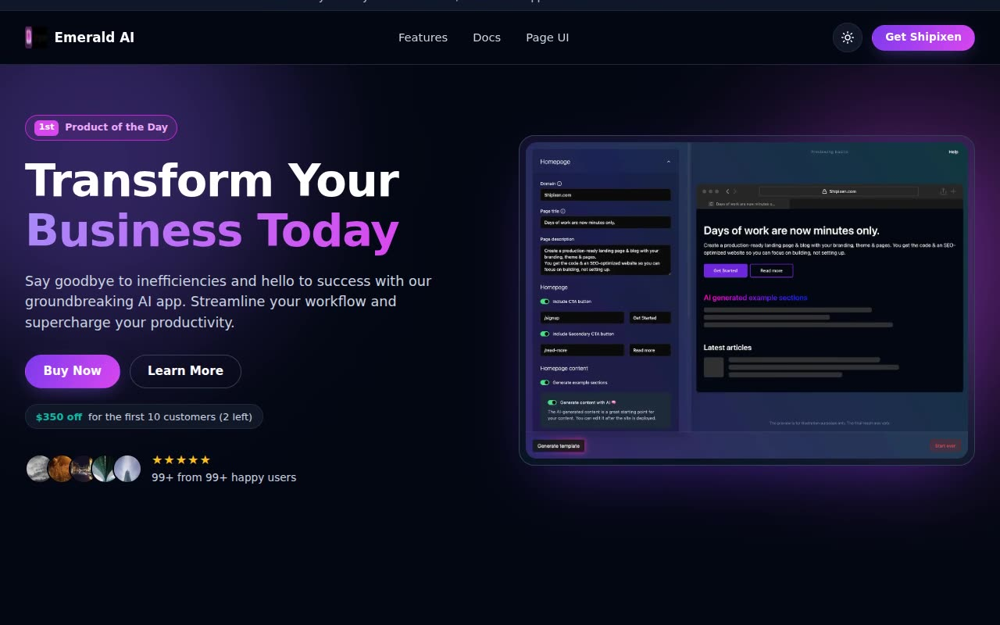

# Emerald AI — AI SaaS Landing Page Template Clone (Vanilla HTML/CSS/JS)

[](./demo.mp4)

A pixel-faithful, fully offline clone of the "Emerald AI" landing page template from Shipixen, rebuilt as self-contained plain HTML, CSS, and vanilla JavaScript with no build step. This single-page dark AI SaaS product landing page features a sticky header, a split hero with product screenshot and "$350 off" pricing pill, alternating feature sections, a testimonial wall, a bento feature grid, and an FAQ accordion — all styled with glassy dark panels, violet-to-fuchsia gradient accents, and a teal/emerald glass glow. It ships light and dark themes (defaulting to dark) with localStorage persistence and no-flash boot, plus a mobile hamburger menu and IntersectionObserver scroll-reveal animations. Generated with Claude Fable 5.

## Run

This is a static site with no build step. All assets are vendored locally, so it runs fully offline. Serve the folder and open it in a browser:

```sh
python3 -m http.server
# then open http://localhost:8000/index.html
```

Or simply open `index.html` directly in your browser.

## Notes

- **Theming:** `index.html` runs an inline no-flash boot script that reads the `emerald-theme` key from `localStorage` (falling back to dark), and the `.theme-toggle` button in `script.js` flips between light and dark, persisting the choice.
- **Interactions:** `script.js` wires the FAQ accordion (animated `max-height` with `aria-expanded`), the mobile hamburger menu, and scroll-entrance reveals via `IntersectionObserver`.
- `prompt.md` holds the full build spec (palette tokens, typography, section-by-section layout) and `demo.mp4` shows the template in motion.

## Credits

Faithful clone of an existing design, recreated for study/learning. All credit for the original design goes to its creators.

**Original:** Shipixen — <https://shipixen.com/demo/landing-page-templates/template/emerald-ai>

---

Part of the [Templates](../) collection in the [claude-directory](../../../README.md) — an open-source gallery of AI-generated UI built with Claude Fable 5. [Browse the live gallery](https://pulkitxm.com/claude-directory).
