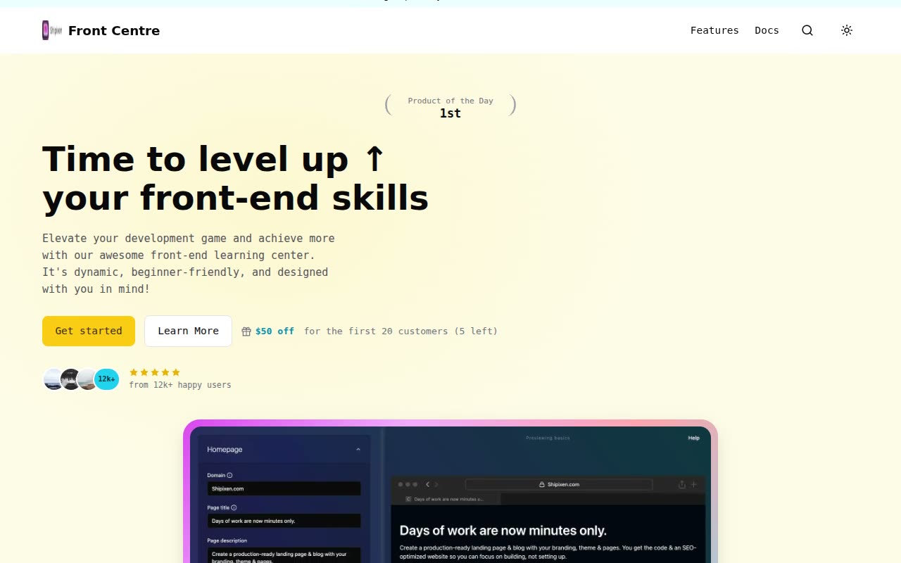

# Front Centre — Front-End Learning Platform Landing Page Template Clone (Vanilla HTML/CSS/JS)

[](./demo.mp4)

A pixel-faithful, fully offline clone of the "Front Centre" landing page template from Shipixen (Page UI), rebuilt as self-contained plain HTML, CSS, and vanilla JavaScript with no build step. This single-page marketing site for a fictional front-end learning platform features a centered cream/pale-yellow hero with a laurel "product of the day" badge and gradient-framed product screenshot, alternating feature rows, an autoplay course-video grid, a masonry testimonial wall, a CTA, and a Radix-style FAQ accordion, closing with the Shipixen marketing footer — all styled with cyan and yellow accents, bold Roboto display headings, and Roboto Mono body copy. It ships light and dark themes (honoring `prefers-color-scheme` on first load) with localStorage persistence and a no-flash boot script, plus IntersectionObserver scroll-reveal animations. Generated with Claude Fable 5.

## Run

This is a static site with no build step. All assets are vendored locally, so it runs fully offline. Serve the folder and open it in a browser:

```sh
python3 -m http.server
# then open http://localhost:8000/index.html
```

Or simply open `index.html` directly in your browser.

## Notes

- **Theming:** `index.html` runs an inline no-flash boot script that reads the `fc-theme` key from `localStorage` (falling back to `prefers-color-scheme`), and the `#theme-toggle` button in `app.js` toggles the `dark` class on the root element, swaps the sun/moon icons, and persists the choice.
- **Interactions:** `app.js` wires the FAQ accordion (chevron rotation with animated panel `height` and `aria-expanded`) and scroll-entrance reveals via `IntersectionObserver`, with a fallback timer that reveals any remaining `.reveal` elements after 1.5s for full-page capture. Course videos autoplay and loop muted directly in the markup.
- `prompt.md` holds the full build spec (palette tokens, typography, section-by-section layout) and `demo.mp4` shows the template in motion.

## Credits

Faithful clone of an existing design, recreated for study/learning. All credit for the original design goes to its creators.

**Original:** Shipixen — <https://shipixen.com/demo/landing-page-templates/template/front-centre>

---

Part of the [Templates](../) collection in the [claude-directory](../../../README.md) — an open-source gallery of AI-generated UI built with Claude Fable 5. [Browse the live gallery](https://pulkitxm.com/claude-directory).
