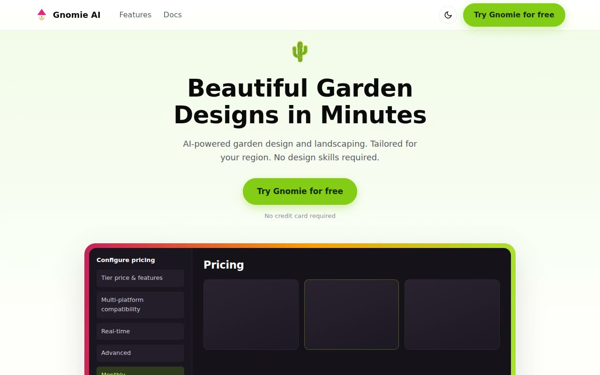

# Gnomie AI — SaaS Landing Page Template Clone (Vanilla HTML/CSS/JS)

[](./demo.mp4)

Gnomie AI is a pixel-faithful clone of the "Gnomie AI" garden-design landing-page template (a Shipixen / Page UI demo), rebuilt as a single-page SaaS marketing site in plain HTML, CSS, and vanilla JavaScript with no build step and all assets vendored locally. It pairs a magenta/pink primary accent with a lime-green secondary over white, uses Montserrat for headings and Hind for body, and reproduces the full long-scroll layout: header, hero, a rotating "Made with Gnomie" user strip, alternating feature and benefit sections, a four-card case-study grid, social-proof and CTA banners, a testimonial grid, a two-tier pricing block with a monthly/annual toggle, a ten-item FAQ accordion on a pink panel, and a large multi-column footer. Interactions include a light/dark theme toggle with localStorage persistence, a responsive hamburger menu, the FAQ accordion, the pricing toggle, rotating prev/next user cards, and scroll entrance fades. Generated with Claude Fable 5.

## Run

No build step — serve the folder with any static server and open `index.html`:

```sh
python3 -m http.server
```

Then visit the printed local URL (e.g. `http://localhost:8000`).

## Notes

- `script.js` handles the theme toggle (persisted under the `gnomie-theme` key), mobile menu, rotating user strips, FAQ accordion, and pricing monthly/annual toggle.
- All images and fonts are vendored under `assets/`.
- `prompt.md` holds the full build spec and `demo.mp4` shows the page in motion.

## Credits

Faithful clone of an existing design, recreated for study/learning. All credit for the original design goes to its creators.

**Original:** Shipixen (Page UI) — <https://shipixen.com/demo/landing-page-templates/template/gnomie-ai>

---

Part of the [Templates](../../../) collection in the [claude-directory](../../../../) — an open-source gallery of AI-generated UI built with Claude Fable 5. [Browse the live gallery](https://pulkitxm.com/claude-directory).
