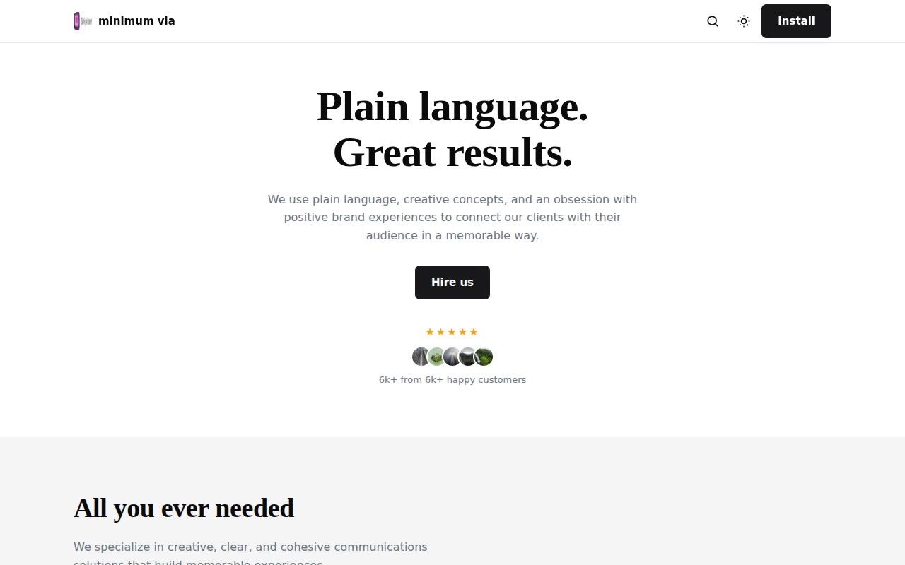

# Minimum Via — Minimalist Agency Landing Page Template (Vanilla HTML/CSS/JS)

[](./demo.mp4)

A pixel-faithful, self-contained clone of the Shipixen "Minimum Via" landing page template — a quiet, minimalist agency / service single-page site that pairs a Roboto Slab slab-serif display face with an Inter sans body on a near-white canvas, using generous whitespace and thin hairline dividers. It includes a working light/dark theme toggle (with `localStorage` persistence and `prefers-color-scheme` defaulting), a FAQ accordion with rotating chevrons, a hero, a four-item service grid, a full-width dashboard showcase, team and testimonial sections, CTAs, and a multi-column footer. Built as plain HTML, CSS, and vanilla JavaScript with no build step, all assets vendored locally so it runs offline. Generated with Claude Fable 5.

## Run

No build step. Serve the folder with any static server and open the entry file:

```sh
python3 -m http.server 8000
# then open http://localhost:8000/index.html
```

You can also open `index.html` directly in a browser.

## Notes

- **Theme toggle** — the header "Toggle dark mode" button toggles the `dark` class on `<html>` and saves the choice to `localStorage` (`mv-theme`). On load, an inline script restores the saved theme or falls back to the OS `prefers-color-scheme` setting.
- **FAQ accordion** — clicking a question toggles its panel open by animating `max-height` to the panel's `scrollHeight`.
- `prompt.md` holds the full build spec, and `demo.mp4` shows the template in motion.

## Credits

Faithful clone of an existing design, recreated for study/learning. All credit for the original design goes to its creators.

**Original:** Shipixen — <https://shipixen.com/demo/landing-page-templates/template/minimum-via>

---

Part of the [Templates](../../) collection in the [claude-directory](../../../) — an open-source gallery of AI-generated UI built with Claude Fable 5. [Browse the live gallery](https://pulkitxm.com/claude-directory).
