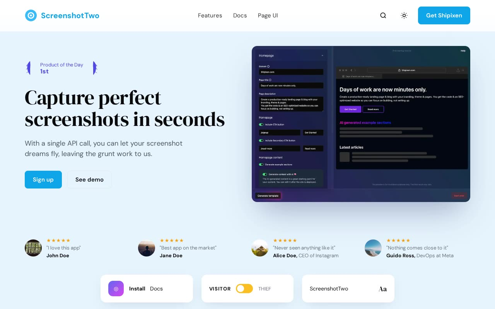

# Screenshot Two — Screenshot-API SaaS Landing Page Clone (Vanilla HTML/CSS/JS)

[](./demo.mp4)

Screenshot Two is a self-contained, same-to-same clone of Shipixen's "Screenshot Two" landing-page template — a single-page marketing site for a fictional screenshot API, rebuilt as plain HTML, CSS, and vanilla JavaScript with no build step. It pairs a sky-blue / indigo accent system with DM Serif Display headings and DM Sans body text, and features a floating header, a centered hero with a large browser mockup, Product Hunt social proof with floating testimonial chips, alternating image-left / image-right feature sections, a full-width indigo CTA band, an autoplay video section, a masonry testimonial grid, a Radix-style FAQ accordion, scroll-reveal entrance animations, and a working light/dark theme toggle. All assets (DM Sans / DM Serif Display fonts, images, video, and avatars) are vendored locally under `assets/`, so it runs fully offline. Generated with Claude Fable 5.

## Run

No build step. Serve the folder with any static server and open `index.html`:

```sh
python3 -m http.server
# then open http://localhost:8000/index.html
```

## Notes

- **Theme toggle** — `app.js` swaps the `light`/`dark` class on `<html>` and persists the choice in `localStorage`.
- **FAQ accordion** — Radix-style open/close pattern; the answer panel expands via `max-height` and the chevron rotates on open.
- **Scroll reveal** — `.reveal` elements fade in via an `IntersectionObserver`, with a `load` fallback that un-hides anything still hidden after 1.5s (handy for headless capture).
- **Mobile menu** — hamburger toggles a `.open` menu that closes on link click.
- `prompt.md` holds the full build spec and `demo.mp4` shows it in motion.

> Note: `poster.jpg` is missing from this folder, so the clickable demo thumbnail is omitted. `demo.mp4` is present.

## Credits

Faithful clone of an existing design, recreated for study/learning. All credit for the original design goes to its creators.

**Original:** Shipixen — Screenshot Two landing-page template — <https://shipixen.com/demo/landing-page-templates/template/screenshot-two>

---

Part of the [Templates](../../README.md) collection in the [claude-directory](../../../README.md) — an open-source gallery of AI-generated UI built with Claude Fable 5. [Browse the live gallery](https://pulkitxm.com/claude-directory).
