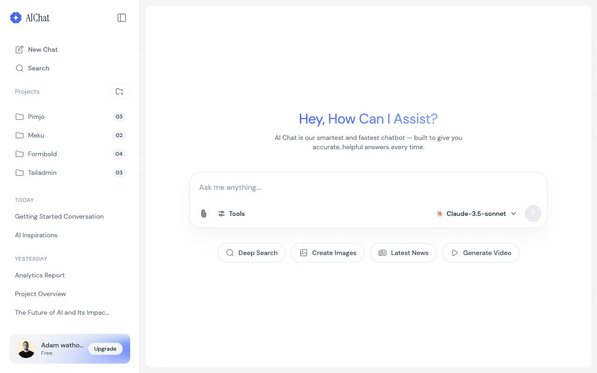

# AIChat — Premium AI Chat Interface Template Clone (Vanilla HTML/CSS/JS)

[](./demo.mp4)

AIChat is a premium AI chat interface and sidebar navigation template, clone-constructed with pixel-faithful accuracy from the original Tailgrids design. Built as a fully offline, zero-dependency static template, it delivers a sleek light/dark theming system using CSS custom properties, a responsive sidebar layout, and smooth interactive states throughout. The front-end is crafted using plain HTML, CSS, and vanilla JS.

## Run

This is a static project that requires no compilation or build steps. Open `index.html` directly in any web browser, or serve locally:

```sh
# Serve using Python 3
python3 -m http.server 8080
```

Then open `http://localhost:8080` in your browser.

## Features

- **AI Chat Interface**: Full-screen chat layout with welcome state, quick-action chips, and a rich chat input area with file attachment and model selector controls.
- **Collapsible Sidebar**: Responsive sidebar with project grouping, chat history list, search, and new-chat button — collapses to zero width on desktop and slides in as a drawer on mobile.
- **Light/Dark Mode**: Theme toggle button that persists preference in `localStorage`, with all colors driven through CSS custom properties (`--color-*` tokens) for seamless switching.
- **Gradient Welcome Title**: Primary-to-accent gradient text using `-webkit-background-clip: text` matching the reference design.
- **Hover Interaction States**: Sidebar items reveal a three-dot options button on hover via an absolutely-positioned sibling element, matching the reference exactly.
- **Responsive Layout**: Flexbox-based sidebar + main area layout that collapses gracefully to mobile with a hamburger menu and overlay drawer.
- **Quick Action Chips**: Clickable prompt chips that pre-populate the chat textarea.

See `prompt.md` for the full build spec; `demo.mp4` shows it in motion.

## Credits

Faithful clone of an existing design, recreated for study/learning. All credit for the original design goes to its creators.

**Original:** Tailgrids — <https://aichat.demos.tailgrids.com>

---

Part of the [Templates](../) collection in the [claude-directory](../../) — an open-source gallery of AI-generated UI built with Claude Fable 5. [Browse the live gallery](https://pulkitxm.com/claude-directory).
