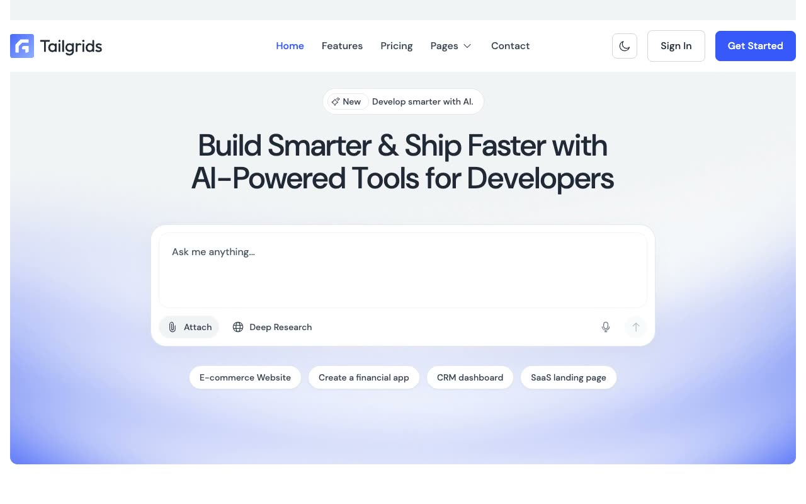

# AISpace — Premium AI SaaS Website Template Clone (Vanilla HTML/CSS/JS)

[](./demo.mp4)

AISpace is a premium AI SaaS landing page and software metric promotional website template, clone-constructed with pixel-faithful accuracy from the original design. Built as a fully offline, zero-dependency static template featuring 10 responsive pages, it delivers a sleek light/dark theming matrix using CSS variables, a responsive layout, custom marquee scrolling, and scroll-reveal interactions. The front-end is crafted using plain HTML, CSS (compiled with Tailwind CSS styles and custom variable tokens), and vanilla JS. Generated with Claude Fable 5.

## Run

This is a static project that requires no compilation or build steps. You can run it by simply opening `index.html` directly in any web browser, or by serving the directory locally using a static web server:

```sh
# Serve using Python 3
python3 -m http.server 8080
```

Then open `http://localhost:8080` in your browser.

## Features

- **10 Core Pages**: Includes Home, Features, Pricing, About, Blog, Blog Details, Sign In, Sign Up, Contact, and a custom 404 page.
- **Sleek Light/Dark Mode**: No-flash theme toggle button that persists the user's preference in `localStorage` and dynamically updates the logo assets.
- **AI-Style Hero Input Panel**: Interactive hero text area resembling a modern AI prompt box with attachment actions, deep research toggle, and topic shortcuts.
- **Sticky Scroll Header**: Translucent header that adds a backdrop blur filter and reduces padding automatically when scrolling.
- **Custom Testimonial Slider**: Fully custom, responsive touch-and-drag slider built with vanilla JS and CSS transforms (no external libraries).
- **Infinite Logo Marquee**: Auto-scrolling brand logo listing carousel.
- **Scroll Reveal Animations**: Fade-in and translate transitions powered by the native `IntersectionObserver` API.

See `prompt.md` for the full build spec; `demo.mp4` shows it in motion.

## Credits

Faithful clone of an existing design, recreated for study/learning. All credit for the original design goes to its creators.

**Original:** Tailgrids — <https://aispace.demos.tailgrids.com>

---

Part of the [Templates](../) collection in the [claude-directory](../../) — an open-source gallery of AI-generated UI built with Claude Fable 5. [Browse the live gallery](https://pulkitxm.com/claude-directory).
