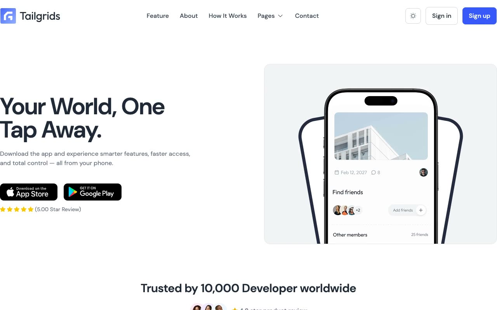

# Appspace - Modern Mobile App Landing Page Template

## Description

Appspace is a premium, pixel-faithful mobile app landing page and promotional website template designed to showcase mobile applications with modern design and premium aesthetics. Recreated as a self-contained reproduction of the Tailgrids Appspace design, it features a complete set of 7 pages built with a robust light/dark mode system.

The template offers a comprehensive set of sections designed to optimize conversions and showcase app features, including:
- **Responsive Navigation Header**: Includes a pages submenu dropdown and an interactive dark mode toggle.
- **Hero Section**: Introduces the application with dynamic layouts, geometric background shapes, and call-to-actions for App Store and Google Play.
- **Client Logo Grid/Slider**: Integrates client brand logos.
- **Features Grid & Card Matrix**: Features dynamic 6-card interactive grid layouts showcasing app functionalities with sleek hover transitions.
- **"How It Works" Timeline**: A clean, 3-step structured progression.
- **High-Converting Call to Action (CTA)**: Large promo card with integrated application mockup previews.
- **Testimonials Grid**: Clean user testimonials and rating cards.
- **Pricing Section**: Standard 3-tier pricing card module system.
- **FAQ Accordion**: Fully interactive accordion drawer.
- **Blog Section**: Includes grid view, article single view, and main highlights.
- **Interactive Forms**: Styled forms for contact, sign-in, sign-up, and newsletters.

---

## Tech Stack

The template is built using clean, standard, and highly optimized frontend technologies:
- **HTML5**: Structured semantic markup for accessibility and search engine optimization.
- **CSS3 (Custom Variables & Tokens)**: Features custom CSS variables (`--color-background-50`, `--color-primary-500`, etc.) in `tokens.css` and compiled responsive styles in `styles.css`.
- **Vanilla JavaScript**: Pure JS handles all interactive elements like the sticky header transition, mobile menus, dropdowns, FAQ accordions, and system/localstorage theme toggle settings.
- **Custom Typography**: Features the modern sans-serif font **DM Sans** (`assets/fonts/dm-sans.woff2`).

---

## Template Structure

The template features a cohesive structure across the following 7 pages:

- **Home (`index.html`)**: The complete landing page featuring all core sections.
- **Blog Grid (`blog.html`)**: Article archive listing with pagination tags.
- **Blog Single (`blog-single.html`)**: Detailed reading template for single articles with sidebar.
- **Sign In (`signin.html`)**: Styled user authentication screen.
- **Sign Up (`signup.html`)**: Styled user registration screen.
- **Contact (`contact.html`)**: Standard contact form with layout for office metrics and links.
- **404 (`404.html`)**: Elegant, thematic error page.

---

## Credits

Faithful clone of an existing design, recreated for study/learning. All credit for the original design goes to its creators.

**Original:** Tailgrids Appspace — <https://appspace.demos.tailgrids.com>
