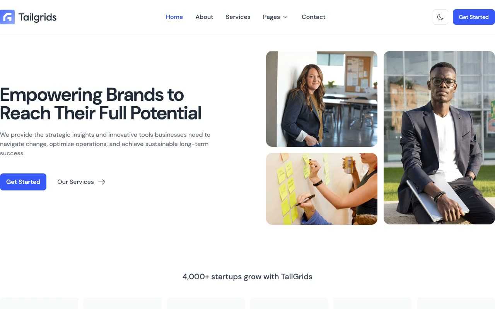

# BizSpace - Professional Corporate Agency and Startup Template

[](./demo.mp4)

BizSpace is a premium, fully-responsive, and pixel-faithful corporate agency and startup template designed to showcase modern businesses with state-of-the-art aesthetics. Built using clean, semantic HTML5, vanilla CSS, and lightweight JavaScript, it runs completely offline with zero build steps or external dependencies. It features a stunning dual-mode (light/dark) theme, smooth animations, and high-performance components, making it the perfect foundation for digital agencies, SaaS landing pages, startups, and professional portfolio websites.

## Key Features

- **Pixel-Faithful Design:** Recreated with absolute precision, matching the premium visual style of the Tailgrids Bizspace template.
- **Dual-Theming System:** Fully integrated light and dark modes with persistent user settings saved in local storage.
- **Modern Color Palette:** Sleek primary blue accent (`#3758F9`) paired with tailored, high-contrast dark backgrounds (`#030712`, `#111827`) and crisp light surfaces.
- **Offline-First & Vendored Assets:** All fonts (DM Sans), graphics, images, logos, icons, and media files are stored locally in the workspace, requiring no external network calls.
- **Fluid Animations:** Smooth entry transitions (fade-in-up, scale-up) and responsive micro-interactions (hover scale, button transitions) for high user engagement.
- **Multi-Page Template Stack:**
  - **Landing Page (`index.html`):** Hero section with illustration, client grids, story teaser, services layout, and interactive slider blocks.
  - **About (`about.html`):** Company background, metrics, team grids, and customer testimonials.
  - **Services (`services.html`):** Detailed list of offering cards, benefits structure, and performance dashboard mockup preview.
  - **Portfolio (`portfolio.html` & `portfolio-details.html`):** Filterable category tabs, project galleries, challenge and approach specs.
  - **Blog (`blog.html` & `blog-details.html`):** Blog post grid with navigation paginators and dedicated reading details page.
  - **Contact (`contact.html`):** Fully integrated contact form with input styling and physical address info.
  - **404 Page (`404.html`):** Centered error layout leading back to the home page.

## Offline Installation & Verification

Follow these steps to open, view, and verify the template locally:

### Step 1: Access the Directory
Navigate to the root directory containing the template files:
```bash
cd /Users/pulkit/.gemini/antigravity/brain/fe017948-cd7a-4ac0-a33a-c2fb244d2adc/.system_generated/worktrees/subagent-Cloner-for-bizspace-self-dd9adce5/templates/premium/tailgrids/bizspace
```

### Step 2: Open Directly in Browser
Since this template uses standard static assets with no compilation build steps, you can open it directly:
- **macOS / Linux:** Double-click `index.html` or run:
  ```bash
  open index.html
  ```
- **Windows:** Double-click `index.html` or drag-and-drop the file into your preferred web browser.

### Step 3: Run a Local Dev Server (Recommended)
Running a local web server is highly recommended to test internal routing, custom layouts, and ensure local asset resolution works exactly as expected.

- **Option A: Python (Quickest)**
  If you have Python installed, run:
  ```bash
  python3 -m http.server 8000
  ```
  Then visit **[http://localhost:8000](http://localhost:8000)** in your web browser.

- **Option B: Node.js (serve)**
  If you have Node.js installed, run:
  ```bash
  npx serve .
  ```
  Then visit **[http://localhost:3000](http://localhost:3000)** (or the port specified in terminal).

### Step 4: Verification Checklist
1. **Header & Sticky State:** Scroll down the homepage and verify the navbar sticks nicely to the top with a subtle shadow.
2. **Dark Mode Toggle:** Click the dark mode button in the header and verify it changes all components to their deep blue-black styling, and that this setting persists across page refreshes.
3. **Animations:** Verify that components fade in smoothly as they scroll into view, and image cards scale smoothly on hover.
4. **Interactive Filters:** On the **Portfolio** page, click through the filter category tabs ("All", "Branding", "UI/UX", etc.) to verify responsiveness.
5. **Form Submission:** Fill out the contact form on `contact.html` and verify input focus states.

## File Structure

```text
bizspace/
├── index.html               # Main Landing Page
├── about.html               # About & Team Page
├── services.html            # Services Listing Page
├── portfolio.html           # Portfolio Listing Page
├── portfolio-details.html   # Portfolio Single Project Details
├── blog.html                # Blog Directory Page
├── blog-details.html        # Single Blog Post Details
├── contact.html             # Contact Form & Details Page
├── 404.html                 # Page Not Found Layout
├── poster.jpg               # Video Poster Image
├── demo.mp4                 # Walkthrough Demo Video
├── assets/                  # Localized Web Assets (Fonts, Icons, Global CSS)
└── images/                  # Project Images and Illustrations
```

## Credits

Faithful clone of an existing design, recreated for study/learning. All credit for the original design goes to its creators.

**Original:** Tailgrids Bizspace — https://bizspace.demos.tailgrids.com
