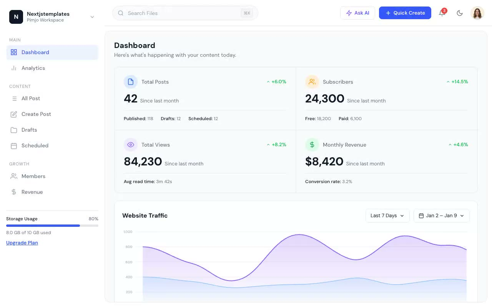

# TailGrids CMS

A pixel-faithful clone of the [TailGrids CMS](https://cms.demos.tailgrids.com) admin dashboard template. Multi-page HTML/CSS with light/dark mode, SVG charts, and vendored assets — no build step required.

## Pages

| File | Route |
|------|-------|
| `index.html` | Dashboard |
| `analytics.html` | Analytics |
| `all-posts.html` | All Posts |
| `create-post.html` | Create Post |
| `drafts.html` | Drafts |
| `scheduled.html` | Scheduled Posts |
| `members.html` | Members |
| `revenue.html` | Revenue & Monetization |

## Stack

- Vanilla HTML + CSS (custom properties, no framework)
- SVG charts (inline, no chart library)
- DM Sans via Google Fonts
- Light/dark toggle via `data-theme="dark"` on `<html>`

## Credits

Faithful clone of an existing design, recreated for study/learning. All credit for the original design goes to its creators.

**Original:** TailGrids — https://cms.demos.tailgrids.com
