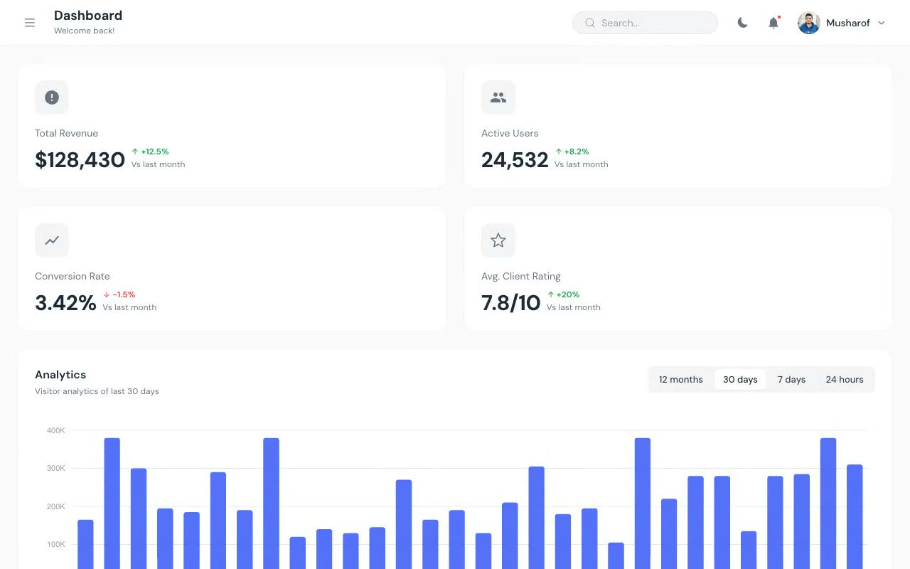

# DashSpace — Admin Dashboard Template Clone

[](./demo.mp4)

A pixel-faithful, self-contained clone of the **DashSpace** admin dashboard template by TailGrids. Built with plain HTML, CSS, and vanilla JavaScript — no build step required, runs offline, and includes full light/dark theme support.

## Overview

DashSpace is a professional SaaS admin dashboard UI template featuring a fixed sidebar navigation, a top header bar with search and user controls, interactive ApexCharts data visualizations, and five content pages: Analytics Dashboard, Calendar, Tables, Profile, and Charts. This clone reproduces the complete design system, all interactions, and both light and dark themes faithfully.

## Features

- **Analytics Dashboard** — KPI metric cards (Total Revenue, Active Users, Conversion Rate, Avg. Client Rating), interactive bar chart with period tabs (12 months / 30 days / 7 days / 24 hours), sessions donut chart, world map, and recent orders table
- **Calendar** — Full month-view calendar with event display, navigation controls, view switcher (Month / Week / Day / Year), and "Add Event" button
- **Tables** — Order history table with sorting controls and pagination, plus recent orders panel with product thumbnails and status badges
- **Profile** — Cover photo, avatar with camera overlay, user bio, social links, and action buttons (Edit Profile, Copy Link)
- **Charts** — Full chart library page featuring bar charts, donut charts, and area/line charts via ApexCharts
- **Sidebar Navigation** — Collapsible dropdown groups (Forms, Pages, Authentication), active state highlighting, mobile hamburger toggle
- **Light / Dark Theme** — All colors driven through CSS custom properties, `localStorage` persistence, no-flash boot script, and system `prefers-color-scheme` support
- **Responsive Layout** — Sidebar slides in/out on mobile, responsive content grid, search bar adapts

## Run Locally

No build step — just open in a browser:

```bash
# Option 1: Python static server
python3 -m http.server 8765 --directory .
# Then open: http://localhost:8765/index.html

# Option 2: Open directly
open index.html
```

## Pages

| File | Route | Description |
|------|-------|-------------|
| `index.html` | `/` | Analytics Dashboard (KPIs, charts, orders) |
| `calendar.html` | `/calendar` | Month-view calendar with events |
| `tables.html` | `/tables` | Order history and recent orders tables |
| `profile.html` | `/profile` | User profile with cover and bio |
| `charts.html` | `/charts` | Chart library (bar, line, donut) |

## Tech Stack

- **HTML5 + CSS3** — Custom properties for theming, CSS Grid/Flexbox layout
- **Vanilla JavaScript** — Sidebar, theme toggle, chart tabs, calendar nav, nav dropdowns
- **[ApexCharts](https://apexcharts.com/)** — Bar, donut, and area charts via CDN
- **DM Sans** — Google Fonts typeface (loaded via CDN)
- All assets vendored locally (logo, avatars, product images, icons)

## Credits

Faithful clone of an existing design, recreated for study/learning. All credit for the original design goes to its creators.

**Original:** TailGrids — <https://dashspace.demos.tailgrids.com>

---

Part of the [Fable templates collection](../../../../templates/) · [TailGrids templates](../) · [All premium templates](../../)
