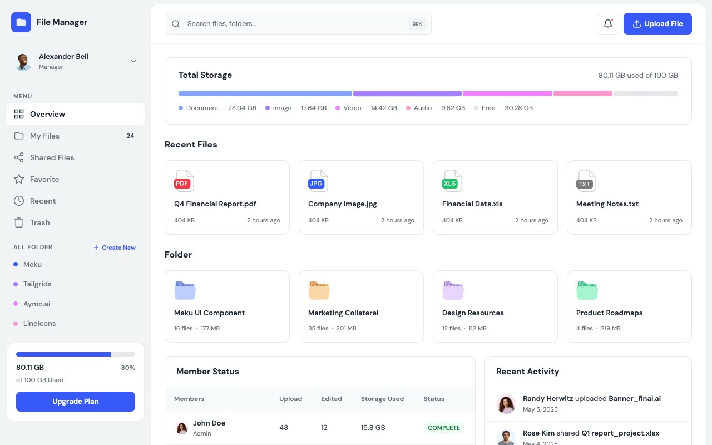

# File Manager — File Manager Dashboard UI Template (Vanilla HTML/CSS + DM Sans)

[](./demo.mp4)

A pixel-faithful clone of the TailGrids File Manager template — a full-featured file manager dashboard UI built with plain HTML and CSS (no build step required). The template features a fixed 272 px sidebar with navigation and a storage widget, a sticky header with search and upload controls, and six interconnected pages covering every core file management workflow: overview, my files, shared files, favorites, recent, and trash. The design uses a clean white and light gray color scheme with a blue primary (`#3758F9`), segmented storage bar, DM Sans typography, and consistent card-based layouts across all pages. Generated with Claude Fable 5.

## Features

- Fixed left sidebar (272 px) with logo, user profile, navigation menu, all-folders section, and segmented storage upgrade widget
- Sticky 72 px header with a search bar, notification bell, and upload-file button
- Six pages, each with its own content layout:
  - **Overview** (`index.html`) — total storage bar, recent files grid, folders grid, member status table, and recent activity panel
  - **My Files** (`my-files.html`) — folder cards, filter tabs, sort/list/grid controls, and a file list table with checkboxes
  - **Shared** (`shared.html`) — folder cards with star badges on favorites, grid view of shared file cards
  - **Trash** (`trash.html`) — 30-day auto-delete warning banner, deleted folder cards, delete files table with restore/delete actions
  - **Favorite** (`favorite.html`) — same layout as My Files filtered to favorited items
  - **Recent** (`recent.html`) — same layout as My Files filtered to recent files
- CSS custom properties for the full design token set (colors, borders, badge variants, storage segment colors)
- DM Sans font (Google Fonts, weights 400/500/600/700)
- Badge system: success (green), neutral (gray), and orange variants
- Storage bar segments: Documents (#85A5FF), Images (#A780FF), Video (#EF84FF), Audio (#FF97CE)

## Run

No build step required. Open any page directly in a browser:

```sh
open index.html
```

Or serve with Python for proper asset resolution across pages:

```sh
python3 -m http.server 8080
# then visit http://localhost:8080
```

Navigate between pages using the sidebar links. All six HTML files share `styles.css` and the `assets/` directory.

## Reference

`prompt.md` holds the full build specification. `demo.mp4` shows the template in motion.

## Credits

Faithful clone of an existing design, recreated for study/learning. All credit for the original design goes to its creators.

**Original:** TailGrids — https://filemanager.demos.tailgrids.com

---

Part of the [TailGrids](../../README.md) provider collection in the [Templates](../../../README.md) section of the [claude-directory](../../../../README.md) — an open-source gallery of AI-generated UI built with Claude Fable 5. [Browse the live gallery](https://pulkitxm.com/claude-directory).
