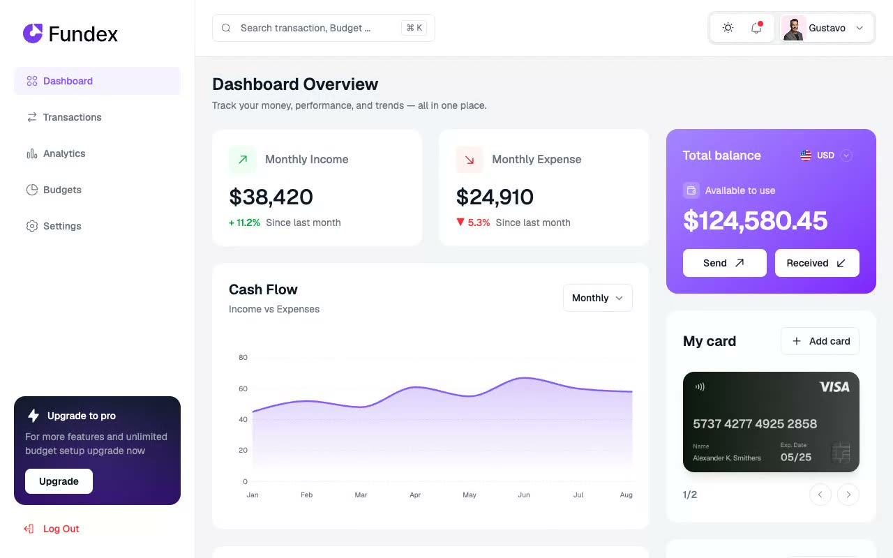

# Fundex — Personal Finance Dashboard Template (Vanilla HTML/CSS/JS + CSS Variables)

[](./demo.mp4)

Fundex is a pixel-faithful, offline-capable clone of the premium Personal Finance Dashboard template from Tailgrids, rebuilt using plain HTML, CSS, and vanilla JS with zero external build dependencies. The design boasts a clean two-tone aesthetic featuring Geist typography, custom interactive SVG charts, debit card carousels, instant search filters, and responsive collapsible menus across five pages. Generated with Claude Fable 5.

## Pages

| File | Description |
|---|---|
| `index.html` | Dashboard Overview featuring monthly income/expense stat cards, cash flow line/area graph, recent transactions table, violet-gradient balance card, debit card carousel, and budget breakdown doughnut chart. |
| `transactions.html` | Master transaction list with search filters by ID/description, category/date range selectors, and mock pagination. |
| `analytics.html` | Cash flow analytics graph visualizing accumulative data, alongside average statistics cards and budget status target indicators. |
| `budgets.html` | Spent vs available data visualizations and categorized budget list featuring status accent badges (Safe, Near Limit, Exceeded) and action controls. |
| `settings.html` | Form settings page with a tabbed sidebar for Profile, Security, and App Preferences, including input forms for user data and avatars. |

## Run

This project consists of plain static HTML, CSS, and JavaScript files that do not require any build or compilation steps. Serve the directory using any static web server:

```sh
python3 -m http.server 8000
```

Then open `http://localhost:8000` in your web browser.

## Features & Notable Techniques

- **Theme Toggle**: Dual-theme switcher (light and dark mode) that updates the `<html>` document class and saves the user's preference in `localStorage`.
- **Responsive Mobile Navigation**: Collapsible left sidebar drawer controlled by JavaScript triggers, sliding smoothly into view on smaller viewports.
- **My Card Carousel Slider**: Swipeable debit card widget that translates smoothly left or right via 3D transforms.
- **Search Keyboard Shortcut**: Listens for the `Cmd + K` or `Ctrl + K` global key combination to instantly focus the main search input field.
- **Tab-Based Form Switching**: Interactive preferences selector on the settings page that dynamically swaps out input sections.
- **Live Transaction Filter**: Inline search handler on the transactions page filtering table entries in real-time as the user types.

## Build spec and demo

The full design requirements and functional specifications are detailed in [prompt.md](./prompt.md), and [demo.mp4](./demo.mp4) demonstrates the final cloned interface in motion.

## Credits

Faithful clone of an existing design, recreated for study/learning. All credit for the original design goes to its creators.

**Original:** Tailgrids — https://fundex.demos.tailgrids.com/

---
Part of the [Templates](../../) collection in the [claude-directory](../../../) — an open-source gallery of AI-generated UI built with Claude Fable 5. [Browse the live gallery](https://pulkitxm.com/claude-directory).
