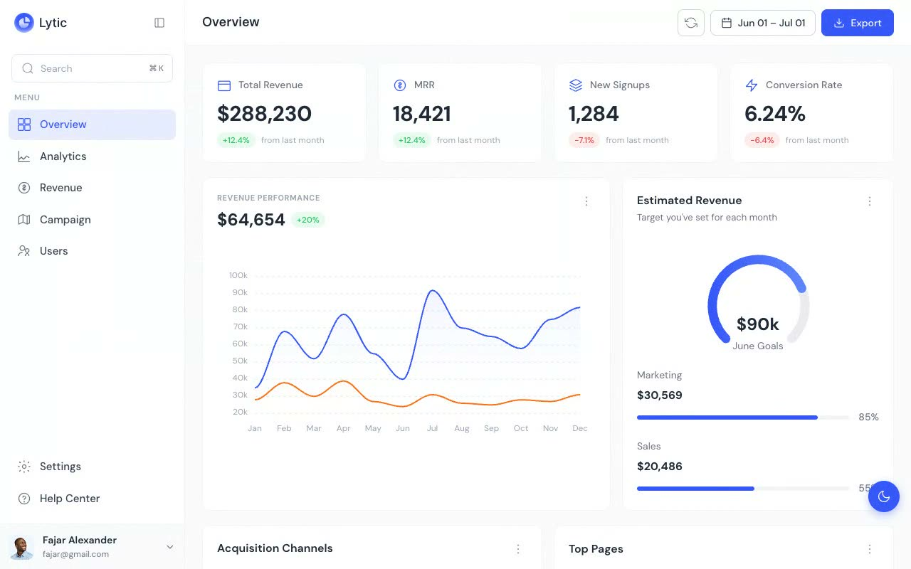

# Lytic Analytics Dashboard UI Template

[](./demo.mp4)

A pixel-faithful clone of the **Lytic** analytics dashboard UI template by TailGrids — a modern, feature-rich SaaS analytics dashboard built with plain HTML, CSS, and vanilla JavaScript.

## Overview

Lytic is a comprehensive analytics dashboard template designed for SaaS products, analytics tools, and data-driven applications. The clone reproduces all seven pages of the original with faithful layout, color tokens, typography, and interactive behaviors including sidebar collapse, dark/light mode, and ApexCharts-powered data visualizations.

## Pages

| Page | Description |
|------|-------------|
| `index.html` | Overview — KPI cards, revenue performance chart, acquisition channels, top pages table |
| `analytics.html` | Analytics — traffic trends, device sessions donut, user locations map, top pages |
| `revenue.html` | Revenue — revenue growth area chart, subscription plan donut, subscription growth |
| `campaign.html` | Campaigns — campaign performance chart, channel distribution, top campaigns table |
| `users.html` | Users — user table with roles, statuses, plan info, and pagination |
| `settings.html` | Settings — tabbed settings panel with workspace, timezone, currency configuration |
| `help.html` | Help Center — quick access cards, support ticket form, common help topics |

## Features

- **Full light and dark mode** — all colors driven through CSS custom properties; no hardcoded hex values; theme persists via `localStorage`; respects `prefers-color-scheme`
- **Collapsible sidebar** — smooth 300ms transition between 260px expanded and 68px icon-only collapsed states; state persists across sessions
- **Responsive layout** — adapts to tablet and mobile with slide-in sidebar overlay
- **Interactive data charts** — ApexCharts area charts, bar charts, donut charts, and radial gauges matching the original's visual style
- **Data tables** — sortable-ready tables with status badges, role badges, pagination controls
- **Settings forms** — working form inputs, selects, and textareas with focus states

## Tech Stack

- Plain HTML5 + CSS3 (no build step)
- Vanilla JavaScript
- [ApexCharts](https://apexcharts.com/) for data visualizations (CDN)
- [DM Sans](https://fonts.google.com/specimen/DM+Sans) from Google Fonts

## Running Locally

```bash
# From this directory
python3 -m http.server 8080
# Then open http://localhost:8080
```

## Design Tokens

| Token | Value |
|-------|-------|
| Primary Blue | `#3758f9` |
| Primary Hover | `#2237ee` |
| Background (light) | `#f9fafb` |
| Background (dark) | `#111827` |
| Font | DM Sans |
| Border Radius | 8–12px |

## Credits

Faithful clone of an existing design, recreated for study/learning. All credit for the original design goes to its creators.

**Original:** TailGrids — <https://lytic.demos.tailgrids.com>

---

[Back to TailGrids templates](../) · [All premium templates](../../) · [Fable template gallery](../../../../)
