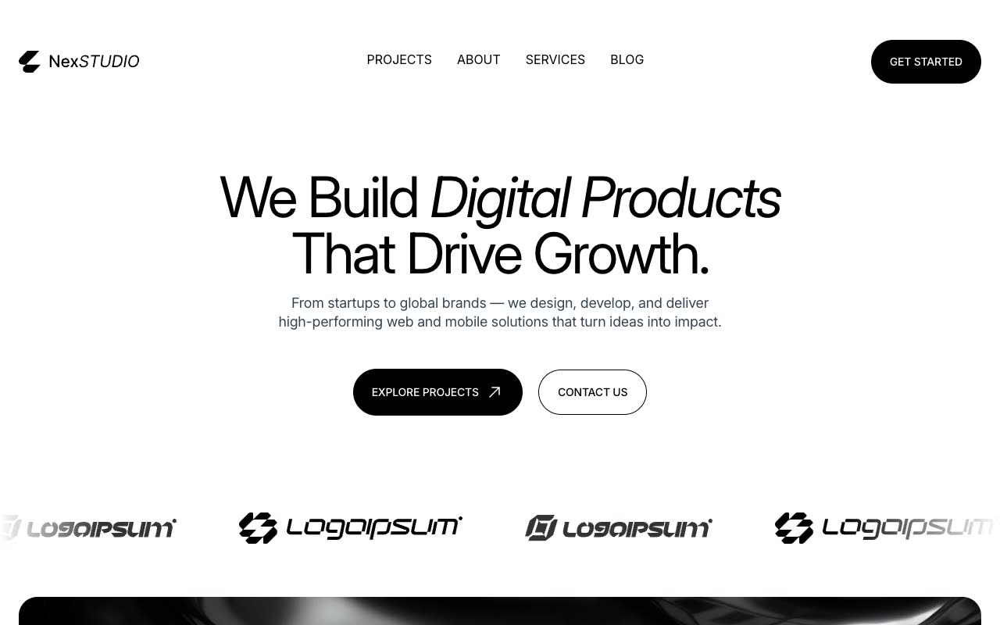

# NexStudio — Creative Agency Website Template (Vanilla HTML/CSS/JS)

[](./demo.mp4)

NexStudio is a modern, monochrome-dominant creative agency website template clone, reconstructed pixel-faithfully from the Tailgrids demo. It features a sleek, high-contrast black-and-white design layout across ten complete pages, including home, portfolio, case studies, blogs, services, about, and contact sections. Built using plain HTML, CSS, and vanilla JavaScript, it runs entirely offline without build tools and integrates custom swiping carousels, sticky elements, smooth scroll-reveals, and an inline theme toggle. Generated with Claude Fable 5.

## Pages

| File | Route / Description |
|---|---|
| `index.html` | Home / landing page with hero, infinite client marquee, stats, why partner grid, services, selected case studies, reviews slider, and blog previews |
| `about.html` | About page outlining the agency's mission, team grid, and core values |
| `services.html` | Services page detailing development capabilities, design system processes, and support |
| `portfolio.html` | Portfolio grid page with category filters for filtering projects |
| `portfolio-detail-1.html` | First detailed case study template showing project overview, challenges, and solutions |
| `portfolio-detail-2.html` | Second detailed case study template for highlighting distinct project structures |
| `blogs.html` | Blog listing grid with category badges, post dates, and search/filter UI placeholder |
| `blog-detail-1.html` | Detailed article view 1 with rich text layout, blockquotes, and social sharing links |
| `blog-detail-2.html` | Detailed article view 2 with alternative media formats and styling |
| `contact.html` | Contact form page with input fields alongside office location and telephone directory details |

## Run

No build step. Serve the folder using any local static web server. For example:

```sh
python3 -m http.server 8080
```

Then navigate to `http://localhost:8080` in your web browser. Alternatively, open `index.html` directly in your browser (some relative-asset paths may require a local server to render correctly).

## Features & Notable Techniques

- **Sticky Header & Responsive Menu** — The header transitions padding and shadow dynamically upon scroll. On mobile, a hamburger button reveals a sliding navigation overlay managed entirely via vanilla JavaScript.
- **Two-Way Text Slide Animations** — Interactive navbar links and pill-shaped action buttons implement a dual-text vertical translation effect on hover.
- **Infinite Logo Marquee** — An endless scrolling client logo marquee that cycles continuously from right to left using pure CSS animation rules.
- **Intersection Observer Scroll Reveals** — Key layout sections smoothly fade and translate upwards (`translateY(75px)` to `none`) as they scroll into view.
- **Swiper.js Testimonials Carousel** — A swipeable testimonials slider configured with Swiper.js, showcasing multiple review cards in a responsive layout.
- **No-Flash Theme Toggle** — Supports dark-theme boot instantly based on user preferences. Flipped with a navbar toggle button and persisted using `localStorage` on a `data-theme` attribute on the root html.

## Build spec and demo

`prompt.md` contains the full design specification, tokens, and page structures used to build this template. `demo.mp4` shows the site in motion, showing all active hover states, scroll animations, and pages.

## Credits

Faithful clone of an existing design, recreated for study/learning. All credit for the original design goes to its creators.

**Original:** Tailgrids — <https://nexstudio.demos.tailgrids.com/>

---

Part of the [Templates](../../../) collection in the [claude-directory](../../../../) — an open-source gallery of AI-generated UI built with Claude Fable 5. [Browse the live gallery](https://pulkitxm.com/claude-directory).
