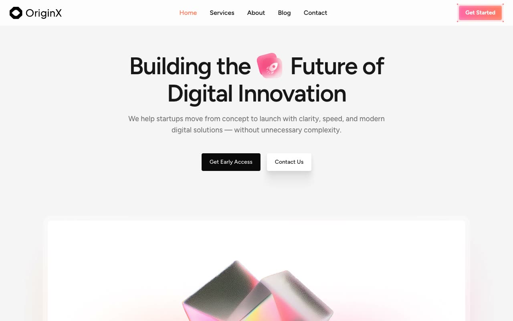

# Originx - Premium Startup & Business Website Template

[](./demo.mp4)

Originx is a high-converting, premium startup and business website template cloned from Tailgrids. Rebuilt as a self-contained, light-weight static project, it showcases clean styling, optimized layouts, and interactive components. Perfect for SaaS startups, modern corporate landing pages, or digital agencies, it leverages custom compiled Tailwind CSS utility styles and pure Vanilla JavaScript to deliver a lightning-fast, dependency-free frontend experience.

## Features

- **Fluid Responsiveness:** Tailored mobile-first design, optimized for screen sizes ranging from extra-small smartphones to ultra-wide desktop monitors.
- **Custom Dark Mode Toggle:** Native dark theme support utilizing a persistent storage state that respects browser preference and prevents layout shifts or flashes on page loads.
- **Smooth Interactivity:** Out-of-the-box Vanilla JS components including a mobile menu overlay, sticky navigation bar, accordion-style FAQs, testimonial carousel, and scroll reveal animations.
- **Premium Design System:** Balanced off-white body styling (`#F5F5F5` on light mode, `#0F0F11` on dark mode), vibrant coral accent tones (`#FF7C61`), elegant Figtree typography, glassmorphism headers, and decorative corner pixel anchors (`#CBCBCB`).
- **SEO Optimized Architecture:** Structured semantic HTML5 outline with single H1 layout tags, proper alt tags, unique identifiers for automated browser testing, and optimized meta configurations.

## Layout & Pages

The template features a comprehensive, multi-page structure that satisfies startup website requirements:

1. **Home (`index.html`)**
   - **Sticky Navigation:** Translucent glassmorphism nav-header with responsive transitions on-scroll.
   - **Hero Banner:** "Building the Future of Digital Innovation" with digital activity emoticons.
   - **Hero Card:** Overlapped image container boasting high-contrast layout borders and visual highlights.
   - **Trusted Clients Showcase:** Grid displaying client avatar clusters and brand logo ribbons.
   - **Asymmetric Product Features:** Alternating column sections titled "Intuitive by Design" and "Built to Evolve" with interactive learn-more tabs.
   - **Why Choose Grid:** A 3-column features card system decorated with custom docker icons and square anchor coordinates.
   - **Testimonials Carousel Slider:** Auto-responsive customer feedback slideshow with linear-gradient pagination bars.
   - **FAQ Accordion:** Interactive, smooth height-transition cards highlighting common inquiries.
   - **CTA Segment:** A high-impact promotional banner pushing early launch access.
2. **Services (`services.html`)**
   - **Overview Grid:** Dedicated cards showing business capabilities like development, design, and consulting.
   - **Workflow Timeline:** Walkthrough demonstrating onboarding and execution steps.
3. **About (`about.html`)**
   - **Company Story:** Interactive layout covering startup metrics (raised capital, active users).
   - **Mission Statements:** Modern side-by-side graphic cards highlighting values.
   - **Team Profiles:** Grid highlighting bios, roles, and integrated social handles.
4. **Blog (`blog.html`) & Blog Detail (`blog-1.html`)**
   - **Blog Grid:** Layout housing editorial thumbnails, read times, categories, and custom pagination.
   - **Rich Detail Page:** A typography-centric content layout styled with embedded blockquotes, lists, images, code sections, and sharing hooks.
5. **Contact (`contact.html`)**
   - **Integrated Form:** Client request inputs designed with responsive feedback styles.
   - **Company Cards:** Detailed text listing office coordinates, support hours, and lines.
6. **Authentication (`signup.html` & `signin.html`)**
   - **Form Layouts:** Centered onboarding templates using adaptive inputs, recovery links, and gradient button actions.

## Tech Stack

- **Structure:** Semantic HTML5 Markup.
- **Styling:** Custom compiled Tailwind CSS utility definitions saved locally in `styles.css`.
- **Logic:** Pure Vanilla JavaScript (ECMAScript 6) containing zero external framework dependencies:
  - **Mobile Menu Overlay:** Dynamically populates links and animates a fullscreen closeable menu drawer.
  - **Sticky Header Navigation:** Listens to window scroll hooks to toggle shadows, backdrops, and backdrop blurs.
  - **Carousel Testimonials Slider:** Computes viewport dimensions (`window.innerWidth`) to translate slide views dynamically (`50%` layout translation on desktop, `100%` on mobile) alongside synchronized custom progress bars.
  - **FAQ Accordion Transition:** Calculates exact content height (`scrollHeight`) to toggle height boundaries smoothly and rotates arrow symbols (`rotate(180deg)`).
  - **Scroll Reveal Animations:** Employs `IntersectionObserver` to trigger fade-in slide-up animation tracks.

## Dark Mode Implementation

The template features a robust dark mode implementation powered by local storage variables:

1. **Anti-Flash Inline Guard:** Pre-rendered script inserted inside the `<head>` tag immediately checks local variables (`localStorage.getItem('color-theme')`) or system CSS media queries (`prefers-color-scheme: dark`) to toggle the `.dark` class on the `<html>` document root before painting the UI.
2. **Interactive Toggle Switch:** The theme toggler button shifts active display icons (sun and moon SVGs) and dynamically controls the `.dark` class while writing choices back to `color-theme` inside local storage.
3. **Adaptive Elements:** Tailwind CSS dark-mode variants (`dark:bg-*`, `dark:text-*`, `dark:border-*`) automatically update element colors, borders, and SVGs to accommodate the dark palette state.

## Run Instructions

Since the template is built as a static client-side project, you can launch it in a few ways:

### Method 1: Local HTTP Server (Recommended)
Using Python's built-in module, start a lightweight web server directly in the template folder:
```bash
python3 -m http.server 8000
```
After launching the command, navigate to [http://localhost:8000](http://localhost:8000) in your web browser.

### Method 2: Live Server (VS Code Extension)
If you are developing inside Visual Studio Code, right-click `index.html` and select **"Open with Live Server"** to run a hot-reloading development workspace.

### Method 3: Direct File Execution
Since the stylesheet and assets are vendored locally, you can double-click `index.html` or open it directly inside any modern web browser without a local server.

## Credits

Faithful clone of an existing design, recreated for study/learning. All credit for the original design goes to its creators.

**Original:** Tailgrids — <https://originx.demos.tailgrids.com/>
