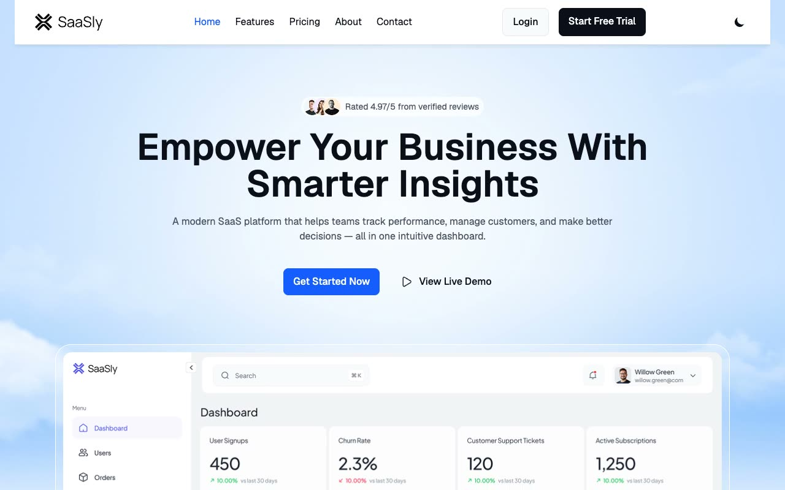

# Saasly — Modern Business SaaS Landing Page Template (Vanilla HTML/CSS/JS)

[](./demo.mp4)

Saasly is a clean, corporate-grade SaaS landing page template cloned from Tailgrids. It features a light neutral-50/white default aesthetic, dark theme toggle options, bold indigo-500 accents (`#155dfc`), dynamic scroll-reactive floating headers, chronological team showcases, local image assets, and accordion-style FAQ lists. Recreated using plain HTML, CSS, and vanilla JS with zero external dependencies and full theme support. Generated with Claude Fable 5.

## Run

This is a static project that requires no compilation or build steps. To run locally, serve it with any static web server:

```sh
python3 -m http.server 8080
```

Then open `http://localhost:8080` in your web browser.

## Features

- **Multi-page Layout**: Includes Home, Features, Pricing, About, and Contact pages.
- **Theme Toggle**: Switch between light and dark modes with a custom button that remembers your preference in local storage.
- **Sticky Header**: Floating header container adjusts padding and transitions to fixed top bar on scroll.
- **Responsive Navigation**: Hamburger menu expands into a responsive menu drawer on mobile.
- **Interactive FAQ Accordions**: Clean accordion elements toggle expand/collapse states dynamically with rotation SVG transitions.
- **Offline Assets**: All fonts, mockups, badges, team photos, and background graphics are locally vendored.

## Credits

Faithful clone of an existing design, recreated for study/learning. All credit for the original design goes to its creators.

**Original:** Tailgrids — <https://saasly.demos.tailgrids.com/>

---

Part of the [Templates](../) collection in the [claude-directory](../../) — an open-source gallery of AI-generated UI built with Claude Fable 5. [Browse the live gallery](https://pulkitxm.com/claude-directory).
