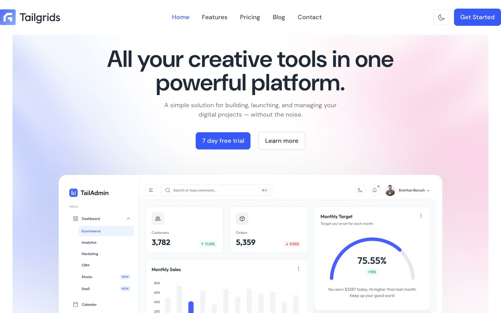

# SaasSpace - Premium SaaS Startup Landing Page Template

[](./demo.mp4)

**SaaSSpace** is a premium, modern, and high-converting SaaS landing page and startup website template designed specifically for software platforms, tech tools, and digital services. Recreated with pixel-perfect accuracy, this template features a clean layout, DM Sans typography, and smooth interactive elements.

---

## 🚀 Key Features

- **Premium Modern Design:** A high-end aesthetic utilizing a curated color palette, sleek gradients, clean borders, and dark/light mode support.
- **Interactive Dark/Light Mode:** Full support for system preferences and user-toggled theme states persisted in `localStorage`.
- **Fully Responsive Layout:** Optimized for seamless display across all device form factors (mobile, tablet, desktop).
- **Interactive Components:** Features smooth marquee animations for client logos, responsive hamburger navigation menu, dynamic FAQ accordion lists, and interactive cards.
- **Optimized Performance:** Fast load times with local assets, modern format images, and localized font files to eliminate external blocking requests.

---

## 📄 Cloned Pages

The template includes a comprehensive suite of 7 fully realized pages:

1. **Home (`index.html`)** - The main marketing landing page.
2. **Features (`features.html`)** - Details about core offerings and value props.
3. **Pricing (`pricing.html`)** - Annual/monthly subscription plans toggle.
4. **Blog List (`blog.html`)** - Clean grid layout for startup insights.
5. **Blog Detail (`blog-details.html`)** - Full article content template.
6. **About (`about.html`)** - Startup backstory and team cards.
7. **Contact (`contact.html`)** - Interactive contact details and form.

---

## 🌓 Dark/Light Mode Toggle Implementation

The template incorporates an inline script within each HTML `<head>` tag to prevent flash-of-unstyled-content (FOUC):
```javascript
if (localStorage.theme === 'dark' || (!('theme' in localStorage) && window.matchMedia('(prefers-color-scheme: dark)').matches)) {
  document.documentElement.classList.add('dark');
} else {
  document.documentElement.classList.remove('dark');
}
```
The state change is updated dynamically using the theme toggle button in the header, which toggles the `.dark` class on the root `<html>` element.

---

## 💻 Detailed Run and Verify Instructions

To run the project locally without any complex build pipeline, you can use any static file server.

### Option 1: Python HTTP Server (Recommended)
1. Ensure you have Python installed on your system.
2. Open your terminal and navigate to this template's directory:
   ```bash
   cd templates/premium/tailgrids/saasspace
   ```
3. Start the built-in HTTP server:
   ```bash
   python3 -m http.server 8000
   ```
4. Open your browser and navigate to:
   [http://localhost:8000](http://localhost:8000)

### Option 2: Node.js static server (e.g., `serve` or `http-server`)
If you have Node.js installed, you can use `npx` to serve the files:
1. Open your terminal in this template's directory.
2. Run the following command:
   ```bash
   npx serve .
   ```
3. Open your browser and navigate to the local address outputted in your console (usually `http://localhost:3000` or `http://localhost:5000`).

---

## Credits

Faithful clone of an existing design, recreated for study/learning. All credit for the original design goes to its creators.

**Original:** Tailgrids — https://saasspace.demos.tailgrids.com
