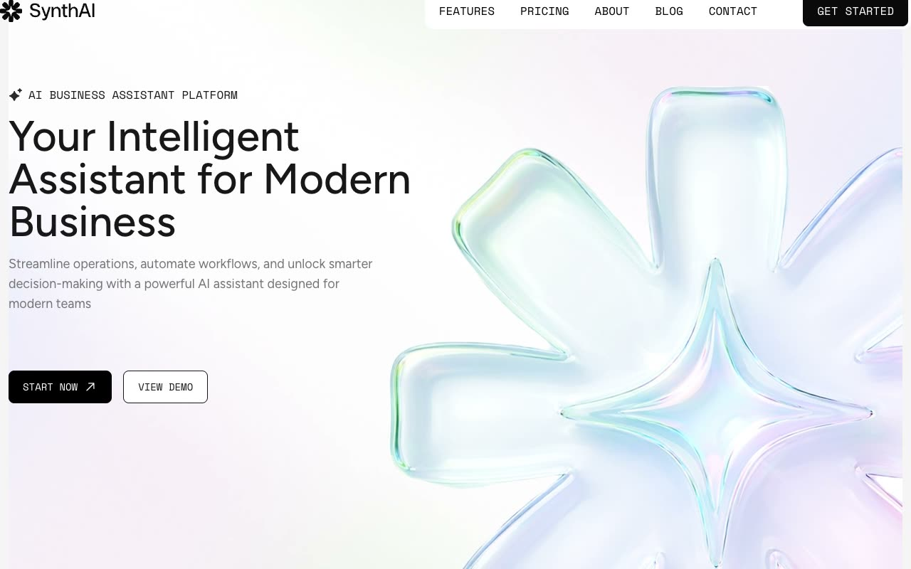

# Synth AI - Premium AI Business Assistant Website Template

[](./demo.mp4)

**Synth AI** is a premium, modern, and high-converting landing page and multi-page website template designed specifically for AI business assistant platforms, SaaS applications, and intelligent automation services. Recreated with pixel-perfect accuracy, this template features a clean layout, refined typography, and smooth interactive elements that immediately convey quality and professionalism to visitors.

---

## 🚀 Key Features

- **Premium Modern Design:** A high-end aesthetic utilizing a curated color palette, sleek gradients, clean borders, and dark/light mode support.
- **Interactive Dark/Light Mode:** Full support for system preferences and user-toggled theme states persisted in `localStorage`.
- **Fully Responsive Layout:** Optimized for seamless display across all device form factors (mobile, tablet, desktop).
- **Interactive Components:** Features smooth marquee animations for client logos, responsive hamburger navigation menu, dynamic FAQ accordion lists, and interactive cards.
- **Optimized Performance:** Fast load times with local assets, modern format images, and localized font files to eliminate external blocking requests.

---

## 📄 Cloned Pages

The template includes a comprehensive suite of 10 fully realized pages:

1. **Home (`index.html`):** The primary landing page featuring a hero showcase, client logos marquee, features section, step-by-step setup guide, integrations, testimonials, and FAQs.
2. **Features (`features.html`):** In-depth overview of the platform's automation, analytics, and AI assistant capabilities.
3. **Pricing (`pricing.html`):** Tiered subscription cards with clear call-to-actions, features comparisons, and pricing structures.
4. **About (`about.html`):** Detailed description of the team, company vision, statistics, and trust markers.
5. **Blog (`blog.html`):** A grid-based blog layout featuring article previews, categories, and pagination.
6. **Blog Details (`blog-details.html`):** Single blog post layout with rich article content, quotes, social share options, and responsive styling.
7. **Contact (`contacts.html`):** Dedicated page with an interactive contact form, support channels, and location details.
8. **404 Page (`404.html`):** A beautifully styled error page helping users easily navigate back to safety.
9. **Privacy Policy (`privacy-policy.html`):** Standard, clean template page for user legal and privacy statements.
10. **Terms of Service (`terms.html`):** Clean layout for standard platform usage terms and conditions.

---

## 🛠️ Technical Stack

- **Structure:** Semantic Plain HTML5 markup (`index.html`, etc.) for maximum accessibility and SEO optimization.
- **Styling:** Vanilla CSS powered by Tailwind CSS 4.0 variables compiled into `/assets/index.css`.
- **JavaScript:** Custom vanilla JavaScript in `/assets/index.js` managing responsive navigation, theme toggle states, marquee pauses, and accordion behaviors.
- **Typography:** Fully self-hosted local `.woff2` font files under `/assets/fonts/` for GDPR compliance, privacy, and speed.
- **Assets:** Fully optimized SVGs (`/images/`), optimized raster images, and local video assets (`demo.mp4`, `poster.jpg`).

### 🌓 Dark/Light Mode Toggle Implementation
The template incorporates an inline script within each HTML `<head>` tag to prevent flash-of-unstyled-content (FOUC):
```javascript
if (localStorage.theme === 'dark' || (!('theme' in localStorage) && window.matchMedia('(prefers-color-scheme: dark)').matches)) {
  document.documentElement.classList.add('dark');
} else {
  document.documentElement.classList.remove('dark');
}
```
The state change is updated dynamically using the `.theme-toggle-btn` class which adds or removes the `.dark` class on the root element.

---

## 💻 Detailed Run and Verify Instructions

To run the project locally without any complex build pipeline, you can use any static file server.

### Option 1: Python HTTP Server (Recommended)
1. Ensure you have Python installed on your system.
2. Open your terminal and navigate to this template's directory:
   ```bash
   cd templates/premium/tailgrids/synthai
   ```
3. Start the built-in HTTP server:
   ```bash
   python3 -m http.server 8000
   ```
4. Open your browser and navigate to:
   [http://localhost:8000](http://localhost:8000)

### Option 2: Node.js static server (e.g., `serve` or `http-server`)
If you have Node.js installed, you can use `npx` to serve the files:
1. Open your terminal in this template's directory.
2. Run the following command:
   ```bash
   npx serve .
   ```
3. Open your browser and navigate to the local address outputted in your console (usually `http://localhost:3000` or `http://localhost:5000`).

---

## Credits

Faithful clone of an existing design, recreated for study/learning. All credit for the original design goes to its creators.

**Original:** Tailgrids — https://synthai.demos.tailgrids.com
