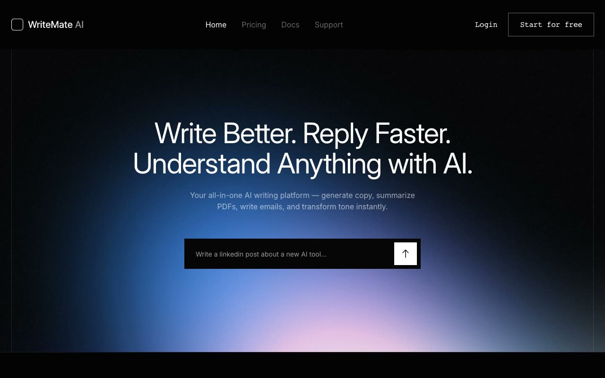

# Writemate — AI Writing Landing Page Template (Vanilla HTML/CSS/JS)

[](./demo.mp4)

Writemate is a modern, premium AI content creation and writing assistant landing page template cloned from Tailgrids. It features a polished monochrome/zinc-950 dark aesthetic, translucent sticky headers, local image assets, accordion-style FAQs, and smooth hover state transitions. Recreated using plain HTML, CSS, and vanilla JS with zero external dependencies and full theme support. Generated with Claude Fable 5.

## Run

This is a static project that requires no compilation or build steps. To run locally, serve it with any static web server:

```sh
python3 -m http.server 8080
```

Then open `http://localhost:8080` in your web browser.

## Features

- **Multi-page Layout**: Includes Home, Pricing, Docs, Support, and Tools (404 page) pages.
- **Theme Toggle**: Switch between light and dark modes with a custom button that remembers your preference in local storage.
- **Sticky Header**: Automatically adjusts padding and adds backdrop blur/translucency on scroll.
- **Responsive Navigation**: Hamburger menu expands into a responsive menu drawer on mobile.
- **Interactive Accordions**: Clean vertical FAQ sections toggle expand/collapse states dynamically.
- **Offline Assets**: All fonts, mockups, badges, and background graphics are locally vendored.
- **Swiper Integration**: Pre-wired and ready for smooth touch and pointer carousel drag on the home page.

## Credits

Faithful clone of an existing design, recreated for study/learning. All credit for the original design goes to its creators.

**Original:** Tailgrids — <https://writemate.demos.tailgrids.com/>

---

Part of the [Templates](../) collection in the [claude-directory](../../) — an open-source gallery of AI-generated UI built with Claude Fable 5. [Browse the live gallery](https://pulkitxm.com/claude-directory).
