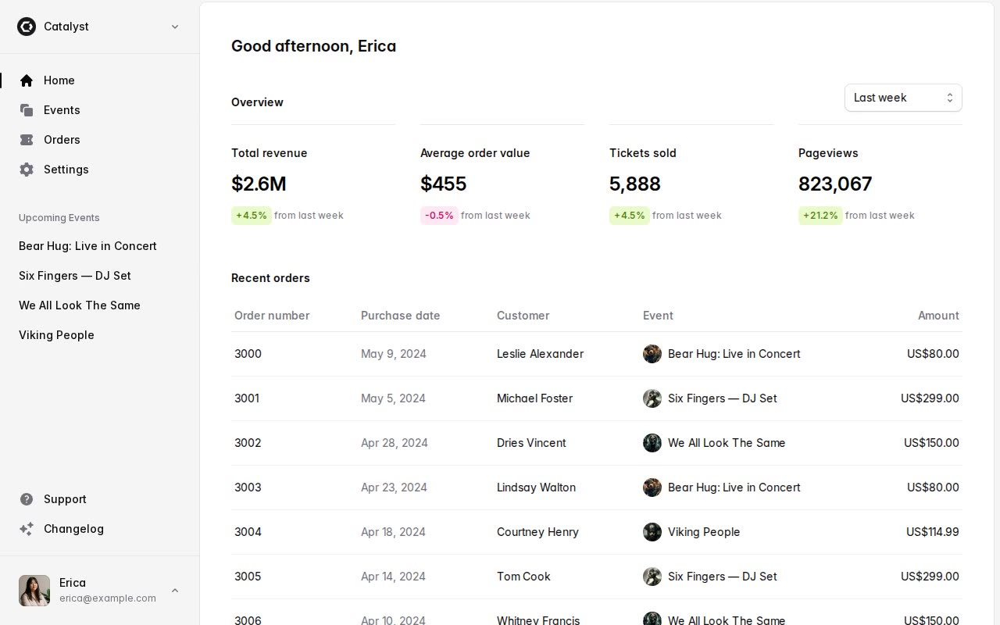

# Catalyst — Event-Management Admin Dashboard Template Clone (Vanilla HTML/CSS/JS + Tailwind v4)

[](./demo.mp4)

A faithful static clone of the Tailwind Plus "Catalyst" application UI kit demo — a fictional event-ticketing admin dashboard signed in as "Erica". This study reproduces the full app across 37 pages: a home dashboard with KPI stat cards and a recent-orders table, an events index with four event-detail pages, an orders index with 26 order-detail pages, a settings form, and centered auth pages (login, register, forgot password). It is built as self-contained plain HTML, CSS, and vanilla JavaScript with no build step — the compiled Tailwind v4 stylesheet, the Inter variable font, all event imagery, the team logo, the user avatar, and the country flag are vendored locally so the clone runs fully offline. The vanilla-JS layer reimplements the original Headless UI behaviours: an account dropdown, a team-switcher dropdown, a mobile slide-in sidebar with backdrop, and a dark-mode toggle mirrored onto `html.dark`. Generated with Claude Fable 5.

## Pages

- `index.html` — home dashboard (greeting, period filter, four KPI stat cards, recent-orders table)
- `events.html` + `events/1000.html`–`events/1003.html` — events index and four event-detail pages
- `orders.html` + `orders/3000.html`–`orders/3025.html` — orders index and 26 order-detail pages
- `settings.html` — organization settings form
- `login.html`, `register.html`, `forgot-password.html` — centered auth layout

## Run

This is a static site with no build step. Serve the folder and open `index.html`:

```sh
python3 -m http.server
```

Then visit `http://localhost:8000/`.

`build.py` is the optional generator that produces the pages from recon artifacts — it is not required to run the clone.

## Stack

- Plain HTML + CSS + vanilla JavaScript (`assets/js/catalyst.js`), no build step
- Compiled Tailwind v4 CSS (`assets/css/catalyst.css`) — zinc neutral ramp, blue-500 accent, built-in `dark:` variant
- Self-hosted Inter variable font (`assets/fonts`)
- Vendored event images, the Catalyst team logo, Erica's avatar, and the Canada flag

See `prompt.md` for the full build spec and `demo.mp4` for the clone in motion.

## Credits

Faithful clone of an existing design, recreated for study/learning. All credit for the original design goes to its creators.

**Original:** Tailwind Plus (Tailwind Labs) — Catalyst application UI kit demo — <https://catalyst-demo.tailwindui.com>

---

Part of the [Templates](../../../) collection in the [claude-directory](../../../../) — an open-source gallery of AI-generated UI built with Claude Fable 5. [Browse the live gallery](https://pulkitxm.com/claude-directory).
