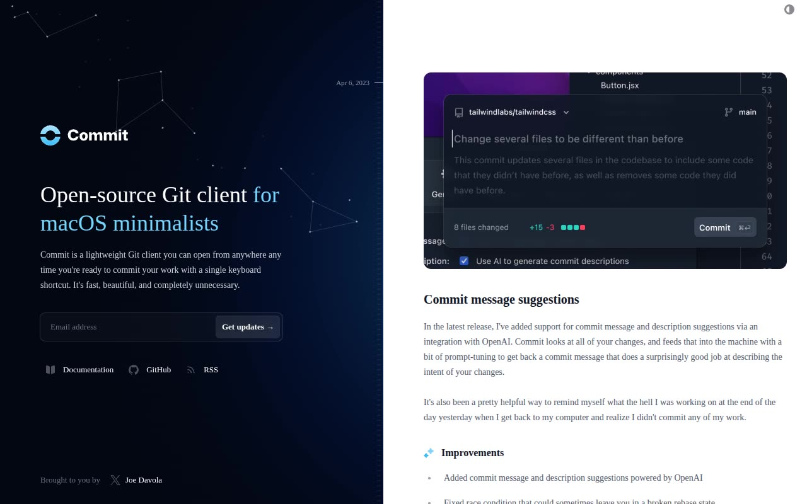

# Commit — Changelog / Release-Notes Template Clone (HTML + CSS + Vanilla JS + Tailwind CSS v4)

[](./demo.mp4)

A self-contained, pixel-faithful clone of the Tailwind Plus "Commit" changelog / release-notes template, rebuilt as plain HTML, CSS, and vanilla JavaScript with no build step. The single-page layout splits into a fixed, always-dark left intro panel (Commit wordmark logo, marketing headline, description, email-signup form, social link chips, and a "brought to you by" credit) and a scrolling right column of four dated changelog entries, each with a product screenshot card, date stamp, prose, and an "Improvements" list. It ships a working light/dark theme toggle (persisted to `localStorage`, respecting `prefers-color-scheme` via an inline boot script to avoid flash), hover states on the social/author link chips, and a decorative email signup form — and runs fully offline, with the compiled Tailwind CSS v4 stylesheet, Inter + Mona Sans woff2 fonts, the four changelog screenshot PNGs, and the favicon all vendored locally under `assets/`. Generated with Claude Fable 5.

## Run

No build step and no dependencies to install — serve the folder over any static HTTP server:

```sh
python3 -m http.server
```

Then open `index.html` via the served URL (for example `http://localhost:8000/`). Any other static server works too. Opening `index.html` directly from disk also works for most browsers, but serving it locally is recommended so the vendored fonts, stylesheet, and images load correctly.

## Notes

- Single page only — the changelog home. In-template links are anchor jumps to the four entries (`#commit-message-suggestions`, `#project-configuration-files`, `#dark-mode-support`, `#commit-v010`) or placeholder `#` links; there are no additional routes.
- Theme toggle: an inline boot script in `index.html` sets the `light`/`dark` class on `<html>` before paint (next-themes parity, no flash); the toggle button writes the choice to `localStorage["theme"]` and otherwise falls back to `prefers-color-scheme`.
- The email-signup form is decorative (`preventDefault`); the submit button and focus ring are styled but do not send data.
- Everything is vendored under `assets/` (`css/app.css`, `fonts/*.woff2`, `img/*.png`, `js/app.js`, `favicon.ico`) so the clone runs without a network connection.
- `prompt.md` holds the full build spec and `demo.mp4` shows the template in motion.

## Credits

Faithful clone of an existing design, recreated for study/learning. All credit for the original design goes to its creators.

**Original:** Tailwind Plus (Tailwind Labs) — <https://tailwindcss.com/plus/templates/commit/preview>

---

Part of the [Templates](../../../) collection in the [claude-directory](../../../../) — an open-source gallery of AI-generated UI built with Claude Fable 5. [Browse the live gallery](https://pulkitxm.com/claude-directory).
