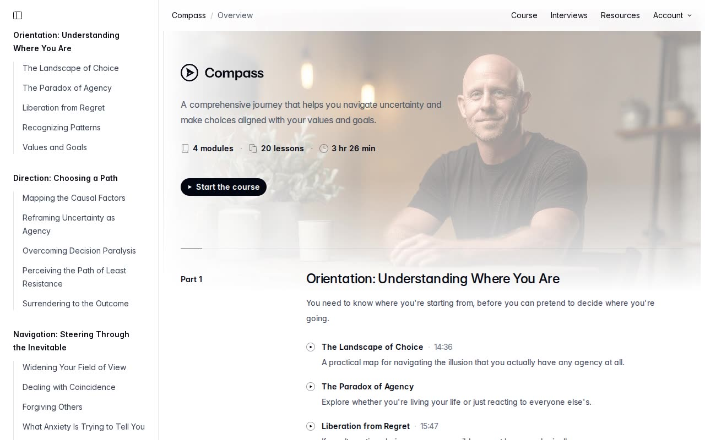

# Compass — Online Course & Personal-Website Template Clone (HTML + CSS + Vanilla JS)

[](./demo.mp4)

A self-contained, pixel-faithful clone of the Tailwind Plus "Compass" online-course / personal-website template, rebuilt as plain HTML, CSS, and vanilla JavaScript with no build step. This light, editorial, typography-first reading experience spans 23 pages — a course overview home, 20 lesson article pages sharing one article layout (each with its own video, prose, and table of contents), an interviews grid, and a resources page — built on a fixed left course sidebar, a sticky frosted top bar, and an Inter + Geist Mono type system. The original's compiled Tailwind CSS v4 stylesheet (OKLCH gray ramp) is preserved verbatim as `assets/css/app.css`, fonts and all imagery/video are vendored locally so it runs fully offline, and a small vanilla-JS shim (`assets/js/app.js`) replaces the proprietary Headless UI + Next.js runtime — reproducing the sidebar collapse, mobile menu, account dropdown menu, scroll-spy table of contents, hover/focus `data-*` states, and native video playback. Built with HTML + CSS + vanilla JS. Generated with Claude Fable 5.

## Run

This is a static site with no build step. Serve the folder with any static file server, for example:

```sh
python3 -m http.server 8000
```

Then open <http://localhost:8000/index.html>.

The lesson article pages live alongside `index.html`: `landscape-of-choice.html`, `paradox-of-agency.html`, `liberation-from-regret.html`, `recognizing-patterns.html`, `values-and-goals.html`, `mapping-causal-factors.html`, `reframing-uncertainty.html`, `decision-paralysis.html`, `path-of-least-resistance.html`, `surrendering-outcome.html`, `widening-field-of-view.html`, `dealing-with-coincidence.html`, `forgiving-others.html`, `anxiety-messages.html`, `maintaining-self.html`, `reframing-achievement.html`, `surrendering-to-success.html`, `giving-credit.html`, `unburden-accountability.html`, and `writing-autobiography.html`, plus `interviews.html` and `resources.html`.

## Notes

- **No proprietary dependencies.** The live template is a Next.js app driven by Headless UI. This clone preserves the original's exact rendered markup and its compiled Tailwind CSS v4 stylesheet (`assets/css/app.css`, obfuscated utility classes and OKLCH gray ramp), and replaces the runtime with `assets/js/app.js` — a dependency-free DOM shim that reimplements the same behaviours: sidebar collapse (`data-sidebar-collapsed`), mobile menu and mobile sidebar overlays, the `Account ▾` dropdown menu, Headless-UI-style `data-hover` / `data-focus` / `data-active` states, an IntersectionObserver scroll-spy "On this page" table of contents, and native `<video>` playback (including the off-screen bottom-right mini-player dock on lesson pages).
- **Vendored assets.** Inter Variable (plus Italic) and Geist Mono fonts are self-hosted under `assets/fonts/`, all imagery lives under `assets/img/`, and lesson/interview clips under `assets/video/`, so nothing is fetched from the network at runtime.
- See `prompt.md` for the full style and layout breakdown (OKLCH palette, typography, per-page structure, four-chapter course outline), and `demo.mp4` (with `poster.jpg`) to see the template in motion.

## Credits

Faithful clone of an existing design, recreated for study/learning. All credit for the original design goes to its creators.

**Original:** Tailwind Plus (Tailwind Labs) — <https://tailwindcss.com/plus/templates/compass/preview>

---

Part of the [Templates](../../../) collection in the [claude-directory](../../../../) — an open-source gallery of AI-generated UI built with Claude Fable 5. [Browse the live gallery](https://pulkitxm.com/claude-directory).
