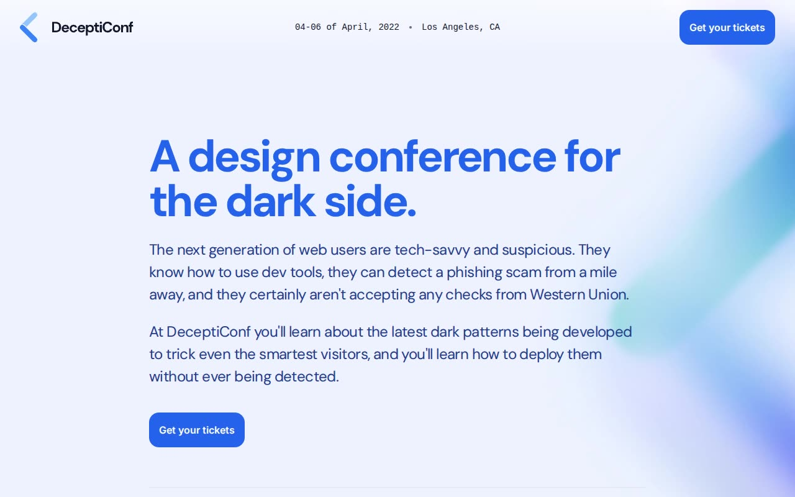

# Keynote (DeceptiConf) — Conference Landing Page Template Clone (Vanilla HTML/CSS/JS)

[](./demo.mp4)

A pixel-faithful, fully offline clone of the Tailwind Plus "Keynote" conference landing-page template — the fictional "DeceptiConf" event ("A design conference for the dark side"). This single-page event marketing site features a header with a mono date/location row and a Get-your-tickets button, a hero with a stats row, a Speakers section with a 3-day tab group rendering six notched ticket-stub portrait cards per day (grayscale-to-color on hover scale), a 3-column desktop / tabbed mobile Schedule of talk lists, a sponsors logo cloud, a newsletter card, and a footer. Built as plain HTML, CSS, and vanilla JavaScript with no build step — Inter + DM Sans fonts, speaker photos, sponsor SVGs, and background glow images are all vendored locally under `assets/`, and a small hand-written `main.js` reimplements the Headless-UI-equivalent tab groups. Generated with Claude Fable 5.

## Run

No build step and no dependencies — just serve the folder statically:

```sh
python3 -m http.server
```

Then open the printed URL (e.g. `http://localhost:8000`) and load `index.html`. You can also open `index.html` directly in a browser, though serving over HTTP is recommended so the local fonts, photos, and SVGs in `assets/` load correctly.

## Notes

- **Tab groups** — `main.js` wires two accessible tab groups (the Speakers day tabs and the mobile Schedule day tabs) with `aria-selected` state, roving `tabindex`, and arrow/Home/End keyboard navigation, swapping the active panel on selection. This stands in for the original's Headless-UI components without any framework.
- **Notched ticket-stub cards** — the speaker portraits use inline SVG `clipPath` definitions (`card-clip-0/1/2`) to produce the notched ticket-stub silhouettes, with grayscale-at-rest images that desaturate to color and scale up on hover.
- **Responsive Schedule** — the three-day schedule renders as three static columns on large screens and collapses to a single tabbed day panel on smaller screens.
- **Fully offline** — Inter and DM Sans fonts, all speaker photos, sponsor logo SVGs, and the grid/newsletter background images are vendored under `assets/`, so the page runs with no network access.
- `prompt.md` holds the full build spec, and `demo.mp4` shows the template in motion.

## Credits

Faithful clone of an existing design, recreated for study/learning. All credit for the original design goes to its creators.

**Original:** Tailwind Plus (Tailwind Labs) — Keynote template — <https://tailwindcss.com/plus/templates/keynote/preview>

---

Part of the [Templates](../../../) collection in the [claude-directory](../../../../) — an open-source gallery of AI-generated UI built with Claude Fable 5. [Browse the live gallery](https://pulkitxm.com/claude-directory).
