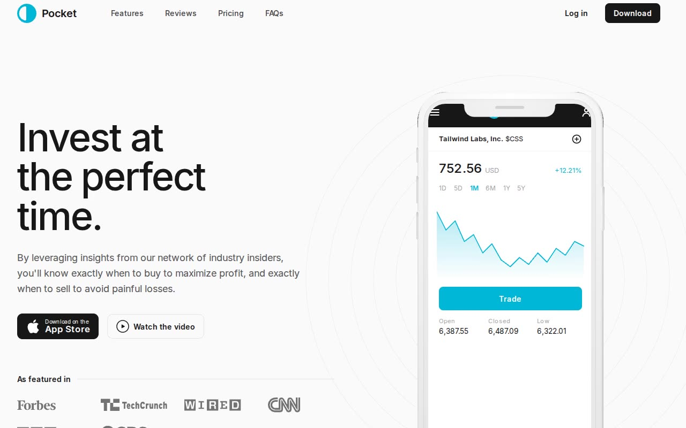

# Pocket — App-Marketing Landing Page Template Clone (HTML + CSS + Vanilla JS)

[](./demo.mp4)

A pixel-faithful, no-build clone of the Tailwind Plus "Pocket" mobile-app marketing template, rebuilt as a 3-page static site in plain HTML, hand-written CSS (Tailwind-equivalent tokens), and vanilla JavaScript. It recreates the dark-accented, cyan-on-neutral landing page around an iPhone `PhoneFrame` mockup — a hero with an animated chart demo screen, a news logo cloud, a dark primary-features section with auto-rotating tabs that cross-fade the phone's in-app screens (invite / stocks / buy), a secondary-features icon grid, a dark CTA, an animated 3-column reviews marquee, a Monthly/Annually pricing toggle with three plan cards (Starter / Investor / VIP), a FAQ grid, a mobile hamburger nav popover, and IntersectionObserver scroll reveals — plus centered-card Login and Register pages. All assets (the Inter variable font, the phone-frame SVG, the eight news-logo SVGs, and the QR code) are vendored locally, so the site runs fully offline with no build step or external requests. Generated with Claude Fable 5.

## Pages

- `index.html` — marketing home: hero, logo cloud, primary features, secondary features, CTA, reviews, pricing, FAQs, footer.
- `login.html` — centered "Sign in to account" card with email + password fields.
- `register.html` — centered "Sign up for an account" card with name, email, password, and a referral select.

## Run

No build step. Serve the folder with any static file server, for example:

```sh
python3 -m http.server
```

Then open `http://localhost:8000/` in a browser. You can also open `index.html` directly, though serving over HTTP is recommended so the vendored fonts and SVG assets load correctly.

## Notes

- Tech: plain HTML, hand-written CSS (`assets/css/tokens.css`, `home.css`, `auth.css`), and vanilla JS (`assets/js/main.js`, `auth.js`) — no framework, no bundler.
- The live Tailwind Plus template runs on Next.js + Headless UI + Framer Motion; this clone replaces that runtime with a small vanilla-JS shim that reimplements the same behaviors: the mobile nav popover, auto-rotating primary-feature tabs with cross-fading phone screens (which become a snap carousel with dot indicators on small screens), the pricing Monthly/Annually toggle, and the animated reviews marquee.
- Fully offline: the Inter variable font (self-hosted WOFF2), the phone-frame SVG, the news-logo SVGs (Forbes, TechCrunch, Wired, CNN, BBC, CBS, Fast Company, HuffPost), and the QR-code SVG are all vendored under `assets/`.
- `prompt.md` holds the full build spec (palette, typography, layout, and interaction details) and `demo.mp4` shows the template in motion.

## Credits

Faithful clone of an existing design, recreated for study/learning. All credit for the original design goes to its creators.

**Original:** Tailwind Plus (Tailwind Labs) — <https://tailwindcss.com/plus/templates/pocket/preview>

---

Part of the [Templates](../../../README.md) collection in the [claude-directory](../../../../README.md) — an open-source gallery of AI-generated UI built with Claude Fable 5. [Browse the live gallery](https://pulkitxm.com/claude-directory).
