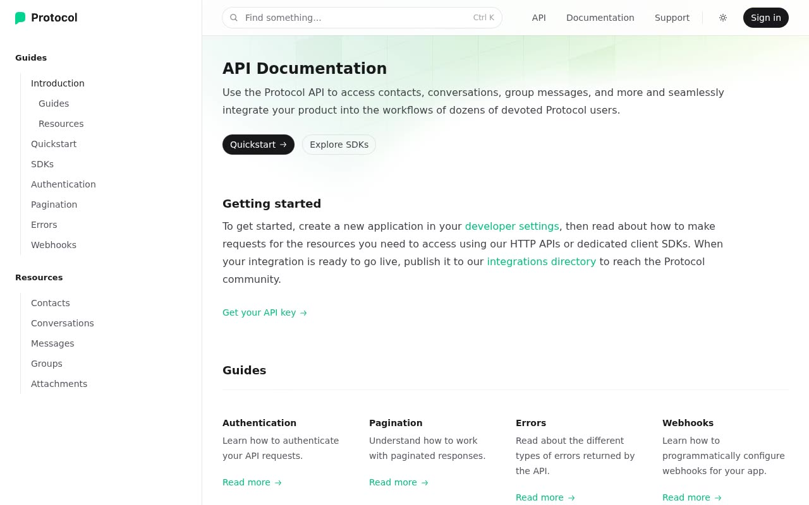

# Protocol — API Documentation Template Clone (Vanilla HTML/CSS/JS)

[](./demo.mp4)

A self-contained, pixel-faithful clone of the Tailwind Plus "Protocol" API-documentation template, rebuilt as plain HTML, CSS, and vanilla JavaScript with no build step. It recreates the classic three-zone developer-docs layout — a fixed left sidebar with an animated sliding active-link highlight, a sticky frosted top bar (Command-K search pill, theme toggle, sign-in), and a centered `prose` content column — plus two-column resource pages with sticky tabbed dark code panels (cURL / JavaScript / Python / PHP request and response samples). It ships 12 pages across an Introduction home, the guide section (Quickstart, SDKs, Authentication, Pagination, Errors, Webhooks), and five API-resource references (Contacts, Conversations, Messages, Groups, Attachments). The proprietary Next.js + Headless UI + Framer Motion runtime is replaced by a small vanilla-JS shim that reimplements the same behaviours — light/dark theme toggle persisted to `localStorage` (with an inline boot script to avoid flash of unstyled theme), mobile nav drawer, search-modal overlay, sidebar scroll-spy with the sliding highlight pill, on-this-page table of contents, code-panel tabs, copy button, and the "Was this page helpful?" toggle. All assets (the compiled Tailwind CSS v4 stylesheet, fonts, and SDK icons) are vendored locally so the clone runs fully offline. Generated with Claude Fable 5.

## Run

No build step and no dependencies — this is static HTML. Either open the page directly:

```sh
open index.html
```

…or serve the folder over HTTP (recommended so relative asset paths resolve cleanly):

```sh
python3 -m http.server
```

Then visit `http://localhost:8000/` and browse to any of the 12 pages (`index.html`, `quickstart.html`, `sdks.html`, `authentication.html`, `pagination.html`, `errors.html`, `webhooks.html`, `contacts.html`, `conversations.html`, `messages.html`, `groups.html`, `attachments.html`).

The full build spec lives in [`prompt.md`](./prompt.md), and [`demo.mp4`](./demo.mp4) shows the clone in motion.

## Credits

Faithful clone of an existing design, recreated for study/learning. All credit for the original design goes to its creators.

**Original:** Tailwind Plus (Tailwind Labs) — <https://tailwindcss.com/plus/templates/protocol/preview>

---

Part of the [Templates](../../../README.md) collection in the [claude-directory](../../../../README.md) — an open-source gallery of AI-generated UI built with Claude Fable 5. [Browse the live gallery](https://pulkitxm.com/claude-directory).
