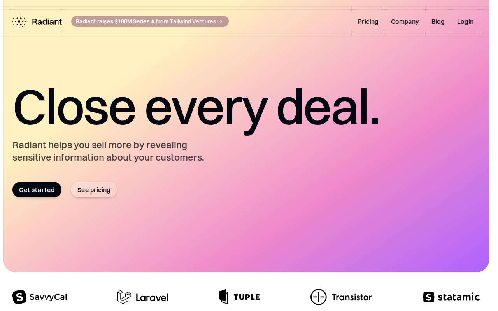

# Radiant — Tailwind Plus SaaS Marketing Template Clone (HTML + Tailwind CSS v4 + Vanilla JS)

[](./demo.mp4)

A self-contained, pixel-faithful clone of the Tailwind Plus "Radiant" SaaS / startup marketing template, rebuilt as plain HTML, CSS, and vanilla JavaScript with no build step. It reproduces the signature warm-yellow-to-pink-to-violet gradient hero panel, the Switzer display typography, the "plus-mark" hairline grid decorations on the nav and footer, dark contrast sections, bento-grid feature layouts, and scroll-triggered fade-up reveals. The build spans 16 pages — a marketing home, pricing, company/about, blog index, login, and 11 individual blog post articles — with all assets (Switzer 400/500/600/700 WOFF2 fonts, compiled Tailwind v4 stylesheet, logos, portraits, map tiles, app screenshot, and blog imagery) vendored locally so it runs fully offline. The proprietary Headless UI + Next.js + Framer Motion runtime is replaced by a small vanilla-JS shim that reimplements the mobile nav disclosure, IntersectionObserver scroll reveals, and hover/focus state behaviours. Generated with Claude Fable 5.

## Run

This is a static site with no build step — serve the folder with any static file server and open `index.html`:

```sh
python3 -m http.server 8000
# then open http://localhost:8000/index.html
```

Any static server works (or open `index.html` directly in a browser). Everything — fonts, CSS, JavaScript, and imagery — is vendored locally under `assets/`, so the site runs completely offline.

## Pages

- `index.html` — marketing home (hero, logo cloud, app-screenshot feature, bento grids, testimonials)
- `pricing.html` — plan cards, feature-comparison table, testimonial, FAQ
- `company.html` — mission, stats, team, investors, open roles
- `blog.html` — blog index with featured row, post list, and pagination
- `login.html` — centered sign-in card on a gradient-glow background
- `blog/*.html` — 11 individual blog post articles sharing one article layout

## Notes

- `assets/css/tailwind.css` is the compiled Tailwind CSS v4 stylesheet; `assets/css/clone.css` holds clone-specific styles.
- `assets/js/shim.js` is the vanilla-JS shim that drives the mobile nav disclosure, scroll-triggered reveals, and `data-*` interaction states.
- `assets/fonts/` self-hosts the Switzer font family (400/500/600/700) as WOFF2.
- `prompt.md` holds the full build spec, and `demo.mp4` shows the template in motion.

## Credits

Faithful clone of an existing design, recreated for study/learning. All credit for the original design goes to its creators.

**Original:** Tailwind Plus (Tailwind Labs) — <https://tailwindcss.com/plus/templates/radiant/preview>

---

Part of the [Templates](../../../) collection in the [claude-directory](../../../../) — an open-source gallery of AI-generated UI built with Claude Fable 5. [Browse the live gallery](https://pulkitxm.com/claude-directory).
