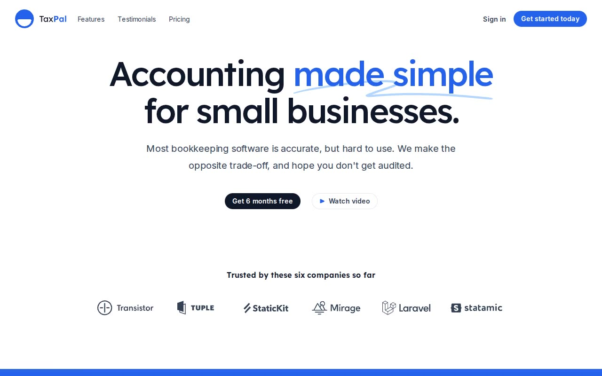

# Salient (TaxPal) — SaaS Marketing Template Clone (Vanilla HTML/CSS/JS)

[](./demo.mp4)

A pixel-faithful, plain HTML + CSS + vanilla JavaScript clone of the Tailwind Plus "Salient" SaaS marketing template, showcased with the fictional accounting product "TaxPal" ("Accounting made simple for small businesses"). It is a light, friendly, rounded startup landing page with big Lexend display headlines, a blue accent, soft slate text, hand-drawn squiggle underlines, and full-bleed angled blue gradient bands behind the feature and CTA sections. The clone self-hosts the Inter + Lexend variable fonts, vendors all screenshots, avatars, logo SVGs, and gradient backgrounds locally so it runs fully offline with no build step, and replaces the original Headless UI + Next.js runtime with a small hand-written CSS token set plus a vanilla-JS shim that reimplements the same behaviours (mobile nav popover, auto-rotating primary-feature tab group, secondary-feature tab group, hover/focus states). Built as a study of someone else's design for learning. Generated with Claude Fable 5.

## Pages

- **`index.html`** — full marketing home: hero, logo cloud, primary features tab group (auto-rotating, four tabs), secondary features tab group (three tabs), CTA band, testimonials, dark pricing cards, FAQ, footer.
- **`login.html`** — split-screen sign in (left white form column, right full-height blue gradient image panel).
- **`register.html`** — split-screen sign up (first/last name, email, password, referral select).

## Run

This is a fully static site — no build step, no dependencies. Serve the folder over a local web server (so relative asset paths resolve), then open the page:

```sh
python3 -m http.server 8000
# then open http://localhost:8000/index.html
```

## Notes

- All assets are vendored under `assets/` (`img/`, `logos/`, `fonts/`, `css/`, `js/`) — the page works offline.
- Styling is hand-written CSS using Tailwind-equivalent design tokens (`assets/css/tokens.css`, `home.css`, `auth.css`); there is no Tailwind toolchain or compile step.
- Interactions live in `assets/js/main.js`: the mobile nav popover (hamburger toggle, dimmed backdrop, outside-click / Esc to close), the auto-rotating primary-features tab group with cross-fading screenshots, and the secondary-features tab group.
- See `prompt.md` for the full build spec (palette, typography, layout, and interaction details) and `demo.mp4` for the template in motion.

## Credits

Faithful clone of an existing design, recreated for study/learning. All credit for the original design goes to its creators.

**Original:** Tailwind Plus (Tailwind Labs) — Salient template — <https://tailwindcss.com/plus/templates/salient/preview>

---

Part of the [Templates](../../../README.md) collection in the [claude-directory](../../../../README.md) — an open-source gallery of AI-generated UI built with Claude Fable 5. [Browse the live gallery](https://pulkitxm.com/claude-directory).
