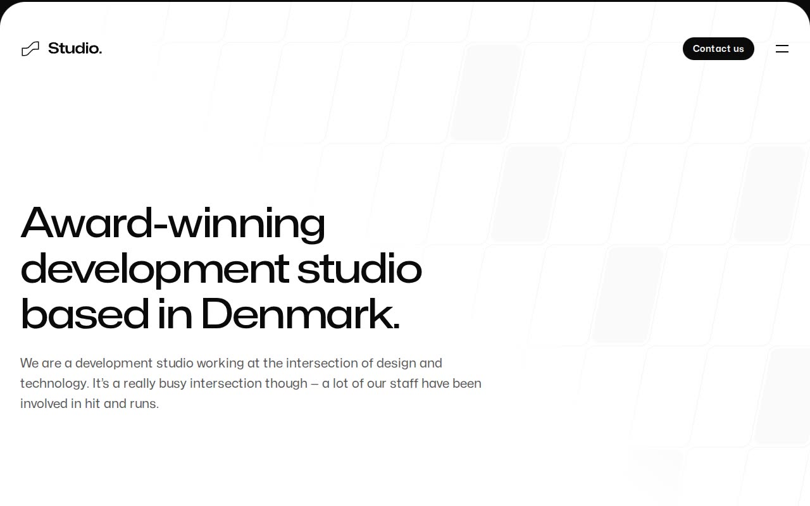

# Studio — Agency / Studio Marketing Template Clone (HTML + Tailwind CSS v4 + Vanilla JS)

[](./demo.mp4)

A self-contained, pixel-faithful clone of the Tailwind Plus "Studio" agency template, rebuilt as plain static HTML, the vendored compiled Tailwind CSS v4 stylesheet, and a small vanilla-JavaScript file — with no build step required to run it. This bold, typography-first, light-on-white editorial layout for a fictional Danish development studio is built around the Mona Sans variable typeface and spans 12 pages: a home page, about, process, a work index with three case-study detail pages (FamilyFund, Unseal, Phobia), a blog index with three blog-post detail pages, and contact — all sharing one expanding header flyout and one fat dark footer. The clone self-hosts the Mona Sans WOFF2 font and vendors every photo, client-logo SVG, and the favicon locally so it runs fully offline, and replaces the original Next.js + Framer Motion runtime with `assets/js/studio.js`, a vanilla-JS shim that reproduces the expanding dark navigation flyout (hamburger to a full-width panel with a 2x2 nav grid plus offices/follow), the FadeIn scroll-reveal entrance animations, and the Tailwind hover states. Built with HTML + Tailwind CSS v4 + vanilla JS. Generated with Claude Fable 5.

## Run

This is a static site with no build step — serve the project folder with any static file server, for example, from the project directory:

```sh
python3 -m http.server
```

Then open <http://localhost:8000/>.

The other pages live alongside `index.html`: `about.html`, `process.html`, `work.html`, `blog.html`, `contact.html`, the case studies under `work/` (`family-fund.html`, `unseal.html`, `phobia.html`), and the blog posts under `blog/` (`future-of-web-development.html`, `3-lessons-we-learned-going-back-to-the-office.html`, `a-short-guide-to-component-naming.html`).

## Notes

- **No build step, no dependencies, offline-first.** The compiled Tailwind CSS v4.3.1 stylesheet (`assets/css/studio.css`, OKLCH neutral ramp), the Mona Sans variable font (`assets/fonts/`), all media (`assets/media/`), and the favicon are vendored locally — nothing loads from a CDN. The live template is a Next.js + MDX + Framer Motion app; this clone preserves its exact rendered markup and copy and replaces the runtime with a dependency-free DOM shim.
- **Navigation flyout** (`assets/js/studio.js`) — the header hamburger expands a full-width black `neutral-950` panel that grows downward and pushes the white page sheet down; the icon morphs between hamburger and X, and the panel holds a 2×2 grid of large nav links plus an offices / follow row. Esc, an outside click, or re-clicking the toggle collapses it.
- **FadeIn scroll-reveal** — elements rendered with `opacity:0; transform:translateY(24px)` fade up into view, staggered via `IntersectionObserver`, and respect `prefers-reduced-motion`. A safety net force-reveals anything still hidden so nothing stays permanently invisible.
- `build.py` is the offline recon/build helper used to assemble the static pages from recon artifacts — it is not needed to run the clone; end users just open the HTML.
- `prompt.md` holds the full build spec, and `demo.mp4` (with `poster.jpg`) shows the result in motion.

## Credits

Faithful clone of an existing design, recreated for study/learning. All credit for the original design goes to its creators.

**Original:** Tailwind Plus (Tailwind Labs) — Studio template — <https://tailwindcss.com/plus/templates/studio/preview>

---

Part of the [Tailwind CSS premium templates](../) directory, in the [Templates](../../../) collection of the [claude-directory](../../../../) — an open-source gallery of AI-generated UI built with Claude Fable 5. [Browse the live gallery](https://pulkitxm.com/claude-directory).
