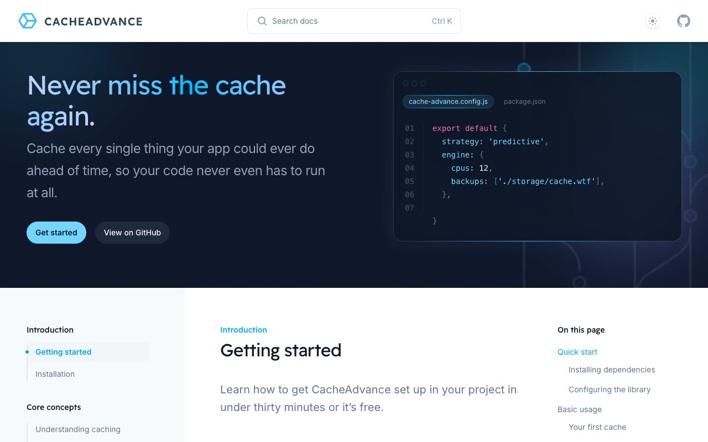

# Syntax — Documentation Site Template Clone (Vanilla HTML/CSS/JS)

[](./demo.mp4)

A self-contained, pixel-faithful clone of the Tailwind Plus "Syntax" software-documentation template, rebuilt as plain HTML, CSS, and vanilla JavaScript with no build step. It documents a fictional caching library, CacheAdvance ("Never miss the cache again."), as a classic three-zone docs layout: a sticky top header with a Command-K search pill, theme listbox, and GitHub link; a fixed left sidebar nav grouped into five sections with a sliding active-section highlight and a sky-500 active-link dot; and a centered `prose` content column with a sticky "On this page" table of contents. The home page opens with a full-width dark slate-900 hero — a gradient wordmark headline, a "Get started" / "View on GitHub" button pair, a skewed dot-grid SVG with cyan/indigo blur glows, and a syntax-highlighted `cache-advance.config.js` code panel. The clone preserves the compiled Tailwind CSS v4 stylesheet and exact rendered markup, self-hosts its Inter + Lexend fonts, and replaces the original Next.js + Headless UI + Framer Motion runtime with a small vanilla-JS shim that reimplements the theme listbox (with `localStorage` and no-flash boot script), mobile nav slide-over, search modal, sidebar scroll-spy, and TOC scroll-spy. The build spans 20 pages — the Getting started home plus 19 `docs/*.html` article pages across the Introduction, Core Concepts, Advanced Guides, API Reference, and Contributing nav sections. Generated with Claude Fable 5.

## Run

This is a static site with no build step — serve the project folder and open `index.html`:

```sh
python3 -m http.server
```

Then visit `http://localhost:8000/` in your browser. Any static file server works; you can also open `index.html` directly, though serving over HTTP is recommended so relative asset and page links resolve correctly.

## Notes

- All assets (the compiled Tailwind CSS v4 stylesheet, Inter + Lexend fonts, and images) are vendored locally so the clone runs fully offline.
- Theme is persisted to `localStorage["theme"]` and respects `prefers-color-scheme` on first load via an inline boot script to avoid a flash.
- `prompt.md` holds the full build spec, and `demo.mp4` shows the template in motion.

## Credits

Faithful clone of an existing design, recreated for study/learning. All credit for the original design goes to its creators.

**Original:** Tailwind Plus (Tailwind Labs) — <https://tailwindcss.com/plus/templates/syntax/preview>

---

Part of the [Templates](../) collection in the [claude-directory](../../) — an open-source gallery of AI-generated UI built with Claude Fable 5. [Browse the live gallery](https://pulkitxm.com/claude-directory).
