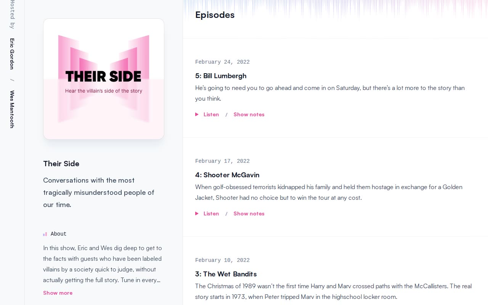

# Their Side — Transmit Podcast Website Template Clone (Vanilla HTML/CSS/JS)

[](./demo.mp4)

A self-contained, pixel-faithful clone of the Tailwind Plus "Transmit" podcast template, rebuilt as plain HTML, CSS, and vanilla JavaScript with no build step. It is a clean, editorial light-mode podcast site — a fixed left sidebar (cover art, show blurb, About, Listen links, vertical "Hosted by" rail), a blue-to-violet-to-pink gradient audio-waveform header, and a sticky bottom audio player — spanning 6 static pages (a home episode index plus 5 episode detail pages) for the fictional show "Their Side." Fonts (Satoshi) and the cover art are vendored locally so it runs fully offline. Generated with Claude Fable 5.

## Pages

- `index.html` — "Episodes" home index: a divided list of 5 episodes (newest first) with mono date eyebrows, titles, descriptions, and a "Listen / Show notes" action row.
- `1.html`–`5.html` — episode detail pages, each with a large round play button, episode title, date, description, and prose body sections (Topics, Sponsors, Links).

All pages share one persistent sidebar, the gradient waveform header, and one sticky audio player.

## Sticky audio player (`assets/app.js`)

Vanilla JS reimplementation of the original's behaviours, driven by a real HTML5 `<audio>` element:

- Play/pause toggle, rewind 10s, fast-forward 10s
- Scrub slider with current/total time (`font-mono`)
- Playback-rate cycle (1×/1.5×/2×) and mute
- Clicking any "Listen"/play button spawns the fixed bottom bar and starts that episode

Because no remote media ships with the clone, the player synthesizes a silent WAV data URI per episode so it has a real, varying duration offline. The About blurb also gets a "Show more" / "Show less" clamp toggle.

## Run

This is a static site — no `package.json`, no build step. Serve the folder and open it in a browser:

```sh
python3 -m http.server 8000
# then open http://localhost:8000/index.html
```

You can also open `index.html` directly in a browser.

## Notes

- Self-hosted Satoshi 400/500/700 WOFF2 weights live in `assets/fonts/`; the "Their Side" cover art is in `assets/img/cover.png`. No external network requests — it works offline.
- Styling is in `assets/styles.css`; all interaction is in `assets/app.js`.
- `prompt.md` holds the full build spec (palette, typography, layout, interaction), and `demo.mp4` shows the result in motion.

## Credits

Faithful clone of an existing design, recreated for study/learning. All credit for the original design goes to its creators.

**Original:** Tailwind Plus (Tailwind Labs) — Transmit podcast template — <https://tailwindcss.com/plus/templates/transmit/preview>

---

Part of the [Templates](../../../) collection in the [claude-directory](../../../../) — an open-source gallery of AI-generated UI built with Claude Fable 5. [Browse the live gallery](https://pulkitxm.com/claude-directory).
