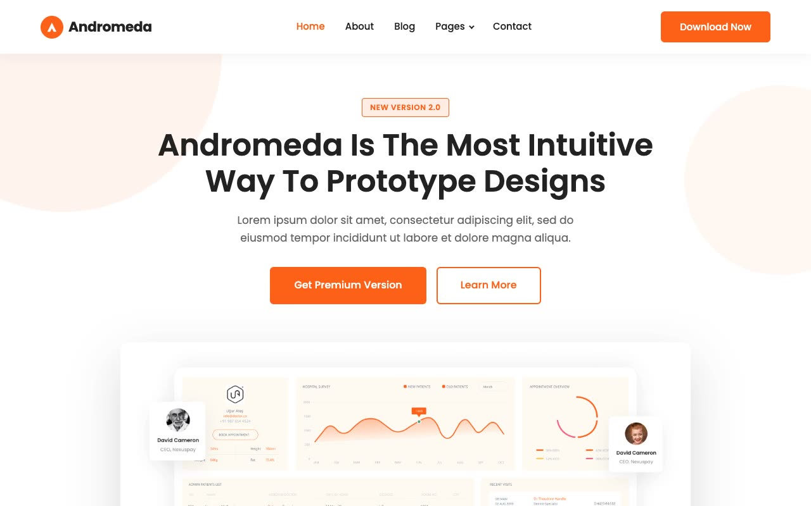

# Andromeda Light — Themefisher SaaS Landing Page Clone

[](./demo.mp4)

A pixel-faithful, self-contained HTML/CSS/JS clone of the [Andromeda Light Next.js template](https://themefisher.com/demo?theme=andromeda-light-nextjs) by Themefisher. No build step required — open any `.html` file directly in a browser.

## Features

- **Light color scheme** with warm orange (`#fe6019`) accent on a clean white background
- **Sticky header** with dropdown navigation and mobile hamburger menu
- **Hero / banner section** with decorative circle motifs and app dashboard screenshot
- **Brands marquee** — infinite-scrolling row of partner logos
- **Video section** — rounded gradient card with play-button popup overlay
- **3 feature sections** — alternating two-column layouts with icon lists and screenshots
- **8 testimonials** in a responsive 4-column grid
- **CTA card** — rounded gradient card with white button
- **4-column footer** with social links and contact info
- **Scroll-entrance animations** — fade-up / fade-from-right on IntersectionObserver
- **Mobile responsive** — full hamburger nav, stacked grids at 991px breakpoint
- **Shared CSS** — single `styles.css` with CSS custom properties (tokens)
- **Real images** — downloaded from the original Themefisher GitHub repository

## Pages

| File | Description |
|---|---|
| `index.html` | Home — full landing page with all sections |
| `about.html` | About — who we are, counters, team cards |
| `blog.html` | Blog — 6-post card grid with pagination |
| `contact.html` | Contact — info cards + contact form |
| `elements.html` | Elements — accordion, tabs, alerts, button showcase |
| `terms.html` | Terms & Conditions |

## Design Tokens

| Token | Value | Usage |
|---|---|---|
| `--color-primary` | `#fe6019` | Buttons, active links, accents |
| `--color-body` | `#ffffff` | Page background |
| `--color-light` | `#fffaf3` | Section tinted backgrounds |
| `--color-dark` | `#1a202c` | Footer background |
| `--color-text` | `#666666` | Body copy |
| `--color-text-dark` | `#222222` | Headings |
| `--color-border` | `#dee2e6` | Dividers, input borders |
| `--color-border-secondary` | `#ffece4` | Light orange borders / icon backgrounds |

**Font:** Poppins (400, 500, 600, 700) via Google Fonts

## Run Instructions

No build step required. Open any HTML file in a browser:

```bash
# macOS
open index.html

# Linux
xdg-open index.html

# Or serve locally (optional)
npx serve .
python3 -m http.server 8080
```

## Assets

All images are stored in `assets/` and sourced from the original Andromeda Light Next.js repository:

- `assets/banner-app.png` — Hero app screenshot
- `assets/features-01/02/03.png` — Feature section images
- `assets/video-popup.jpg` — Video thumbnail
- `assets/brands/01-06-colored.png` — Partner logos for marquee
- `assets/user-img/user-img-01-08.png` — Testimonial avatars
- `assets/team-01-04.png` — Team member photos
- `assets/blog-01-03.png` — Blog post thumbnails
- `assets/about.png` — About section image

## Links

- [Template Source](https://themefisher.com/demo?theme=andromeda-light-nextjs)
- [Themefisher](https://themefisher.com)
- [All Templates](../../README.md)
- [Root Directory](../../../../README.md)
