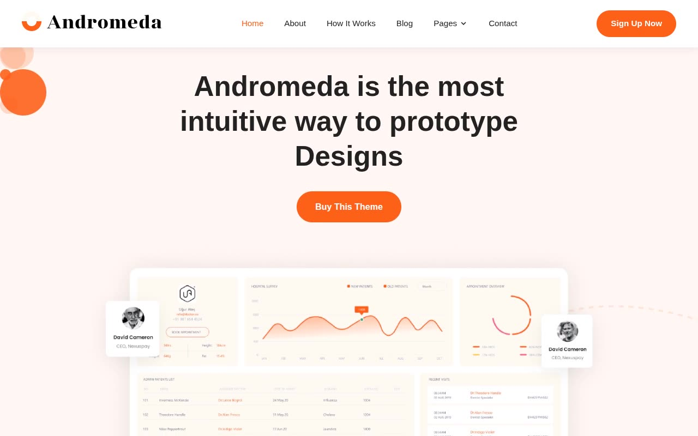

# Andromeda — SaaS Landing Page Template Clone (Vanilla HTML/CSS/JS + AOS + Swiper)

[](./demo.mp4)

Pixel-faithful reproduction of the Andromeda Next.js SaaS template by ThemeFisher, rebuilt as a self-contained plain HTML/CSS/JS project with no build step required. The design features a clean white layout with an orange primary accent (`#FE6019`), Poppins typography, decorative floating circles, AOS scroll-fade animations, Swiper carousels for brands and testimonials, and a light/dark theming system driven entirely by CSS custom properties. The project ships 13 complete pages — home, about, how it works, blog, pricing, contact, careers, case studies, elements, changelog, terms and conditions, sign in, and sign up — all sharing a single `assets/styles.css` design system and a `assets/components.js` that injects the nav and footer and initialises AOS. Generated with Claude Fable 5.

## Run

No build step required. Open any page directly in a browser:

```
open index.html
```

Or serve the folder over HTTP (recommended, so relative paths resolve correctly):

```sh
cd templates/premium/themefisher/andromeda-nextjs
python3 -m http.server
# then visit http://localhost:8000
```

## Pages

| File | Page |
|---|---|
| `index.html` | Home |
| `about.html` | About |
| `how-it-works.html` | How It Works |
| `blog.html` | Blog |
| `pricing.html` | Pricing |
| `contact.html` | Contact |
| `careers.html` | Careers |
| `case-studies.html` | Case Studies |
| `elements.html` | Elements |
| `changelog.html` | Changelog |
| `terms-and-conditions.html` | Terms and Conditions |
| `signin.html` | Sign In |
| `signup.html` | Sign Up |

## Notable techniques

- **Shared design system** — `assets/styles.css` defines all colour tokens, typography scale, spacing, and component styles as CSS custom properties. Dark mode is applied via `:root.dark` overrides, toggled without JavaScript reloads.
- **Component injection** — `assets/components.js` dynamically writes the fixed navbar (with dropdown and mobile hamburger) and the 4-column footer into every page, keeping markup DRY across 13 files.
- **AOS scroll animations** — Animate On Scroll (AOS) library drives `fade-up` entrance animations throughout; easing is `ease` at 400 ms duration.
- **Swiper carousels** — a looping auto-play brand logo strip (grayscale-to-colour on hover), a feature card slider, and a testimonials carousel are all built with Swiper.
- **Decorative circles** — pure CSS `border-radius: 50%` elements with varying opacity create the floating orange bubble motif in the hero and page banners.
- **Split auth layouts** — `signin.html` and `signup.html` use a two-column full-height layout (orange illustration panel + white form panel) with no shared nav or footer.
- **Pricing toggle** — `pricing.html` includes a monthly/annual billing toggle switch animated with a cubic-bezier transition; the featured "Team" tier uses a solid orange card.

`prompt.md` holds the full visual specification and `demo.mp4` shows the template in motion.

## Credits

Faithful clone of an existing design, recreated for study/learning. All credit for the original design goes to its creators.

**Original:** ThemeFisher — <https://themefisher.com/demo?theme=andromeda-nextjs>

---

Part of the [Templates](../) collection in the [claude-directory](../../) — an open-source gallery of AI-generated UI built with Claude Fable 5. [Browse the live gallery](https://pulkitxm.com/claude-directory).
