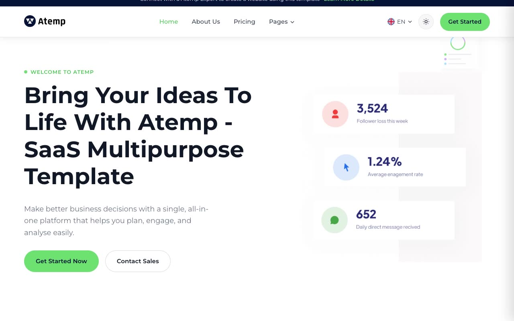

# Atemp — SaaS/Multipurpose Marketing Next.js Template Clone (Vanilla HTML/CSS/JS)

[](./demo.mp4)

Atemp is a light, clean SaaS/multipurpose marketing template for a social-media-analytics product, rebuilt pixel-faithfully as a self-contained, 20-page static clone with no framework and no build step. It reproduces the white/off-white base palette with a bright lime-green accent and deep-navy footer/CTA band, Montserrat typography, pill-shaped buttons, rounded card panels with soft drop shadows, dashboard-mockup illustrations, decorative circular/triangle SVG shapes, scroll-entrance reveal animations, hover-dropdown navigation, and card/button hover-lift transitions — including a light/dark theme toggle (persisted to `localStorage`, honoring `prefers-color-scheme`) that was added for this clone since the source template only ships a light theme.

## Pages

Home, About, Pricing (Monthly/Yearly toggle), Features, Elements (UI kit/style-guide showcase), Career, Contact, Terms & Conditions, Blog index plus 2 pagination pages and 5 blog posts, and an Integration index plus 8 integration detail pages (Mailchimp, Airtable, Discord, Gmail, Google Meet, Slack, Stripe, Zoom). All pages share the same sticky header (logo, nav with a "Pages" dropdown, language switcher, Contact Sales / Get Started buttons, mobile hamburger) and dark-navy footer (brand blurb, social icons, office addresses, newsletter signup, and link columns).

## Run

This is plain HTML/CSS/vanilla JS — there is no `package.json` and no build step. Serve the folder with any static file server from the project root:

```sh
python3 -m http.server
```

Then open `http://localhost:8000/` (or `index.html` directly) in a browser.

## Notes

- `prompt.md` contains the full build spec — color tokens, typography scale, motion details, and the complete page-by-page layout breakdown used to build this clone.
- `demo.mp4` (with `poster.jpg` as its thumbnail) shows the site in motion, including scroll-reveal animations, the pricing toggle, and the light/dark theme switch.
- Assets (fonts, images, CSS, JS) live under `assets/`; blog posts live under `blog/`; integration detail pages live under `integration/`.

## Credits

Faithful clone of an existing design, recreated for study/learning. All credit for the original design goes to its creators.

**Original:** ThemeFisher — <https://themefisher.com/demo?theme=atemp-nextjs>

---

Part of the [Templates](../) collection in the [claude-directory](../../../) — an open-source gallery of AI-generated UI built with Claude Fable 5. [Browse the live gallery](https://pulkitxm.com/claude-directory).
