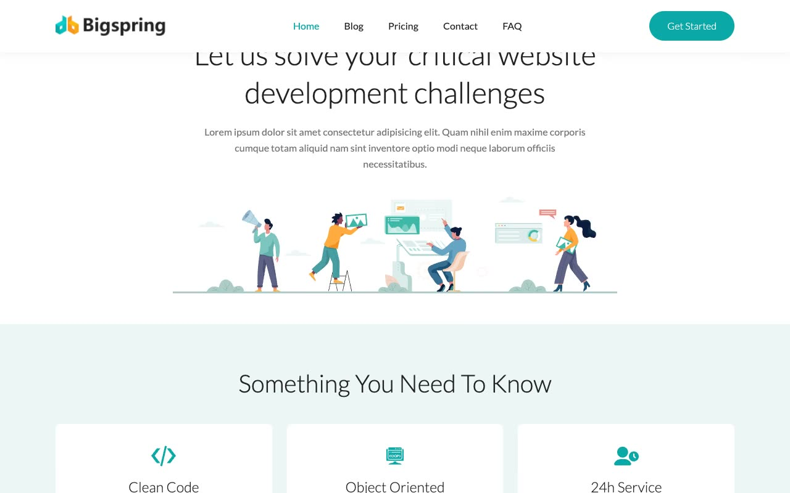

# Bigspring Light — SaaS/Agency Marketing Template Clone (Vanilla HTML/CSS/JS)

[](./demo.mp4)

Bigspring Light is a slim, all-white SaaS/agency marketing template rebuilt pixel-faithfully as a self-contained static clone with no framework and no build step. It reproduces the flat top nav (no mega-menu, no theme toggle), a solid teal (`#0aa8a7`) primary accent, pale-mint (`#edf6f5`) alternating section bands, hand-drawn "undraw"-style illustration art in the hero and CTA blocks, and Lato typography throughout, along with hover states on nav links/buttons/cards, a highlighted pricing card, a mobile hamburger menu, and a contact form.

## Pages

- **Home** (`index.html`) — hero, "Something You Need to Know" 6-card feature grid, 4 alternating image+copy feature rows, illustration banner, CTA card
- **Blog** (`blogs/index.html`) — featured post + 2-column grid of remaining posts
- **Blog posts** (`blogs/blog-1/`, `blogs/blog-2/`, `blogs/blog-3/`) — full markdown-style article bodies with headings, code blocks, blockquotes, tables, and embedded video placeholder
- **Pricing** (`pricing/index.html`) — 3-card plan grid (Basic / Professional / Business) with the center card raised and highlighted, plus a "Need a Larger Plan?" illustration banner
- **Contact** (`contact/index.html`) — contact form (name / email / subject / message) alongside contact details
- **FAQ** (`faq/index.html`) — 2-column, 3-row grid of question cards with check icons

All pages share the same header (logo + flat nav + "Get Started" pill button + mobile hamburger) and footer (link columns, social icons, copyright bar on a pale-mint band).

## Run

This is plain HTML/CSS/vanilla JS — there is no `package.json` and no build step. Serve the folder with any static file server from the project root:

```sh
python3 -m http.server
```

Then open `http://localhost:8000/` (or `index.html` directly) in a browser.

## Notes

- `prompt.md` contains the full build spec — color tokens, typography scale, and the complete page-by-page layout breakdown used to build this clone.
- `demo.mp4` (with `poster.jpg` as its thumbnail) shows the site in motion.
- Assets (fonts, images, CSS, JS) live under `assets/`.

## Credits

Faithful clone of an existing design, recreated for study/learning. All credit for the original design goes to its creators.

**Original:** Themefisher — <https://themefisher.com/demo?theme=bigspring-light-nextjs>

---

Part of the [Templates](../) collection in the [claude-directory](../../../) — an open-source gallery of AI-generated UI built with Claude Fable 5. [Browse the live gallery](https://pulkitxm.com/claude-directory).
