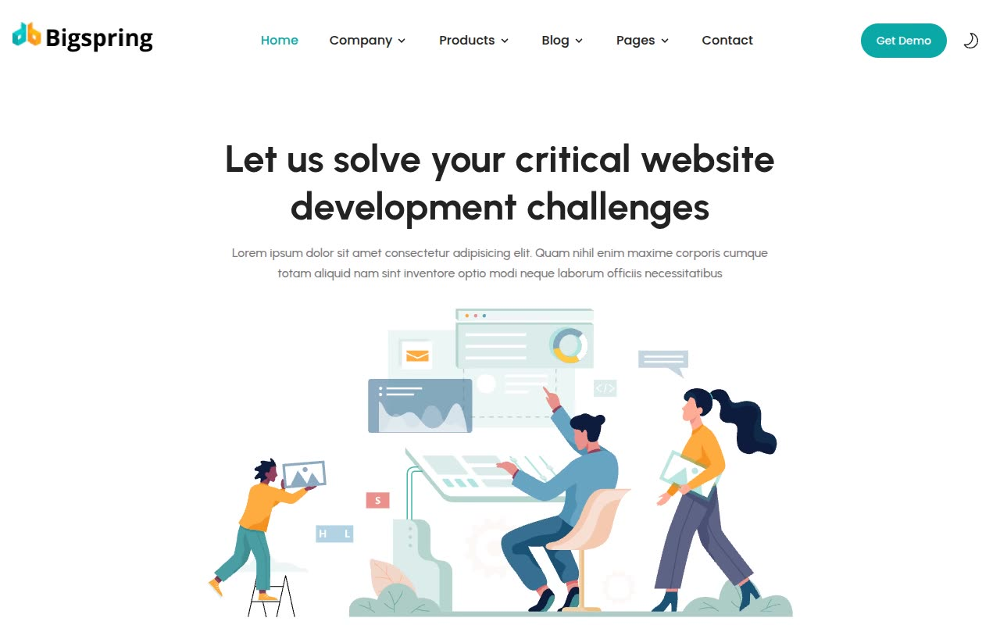

# Bigspring — SaaS/CRM Marketing Template Clone (Vanilla HTML/CSS/JS)

[](./demo.mp4)

Bigspring is a light, friendly SaaS/startup marketing template (CRM/productivity-tool positioning) rebuilt pixel-faithfully as a 35-page, self-contained static clone with no framework and no build step. It reproduces the white base palette with mint/pale-teal section bands, a solid teal accent, hand-drawn "undraw"-style illustration art, Urbanist headings with Poppins body copy, a mega-menu nav, a Swiper testimonial/logo carousel, an FAQ accordion, and a real light/dark theme toggle (Tailwind `.dark` class based, with a boot script that honors `prefers-color-scheme` and persists the choice to `localStorage`). Generated with Claude Fable 5.

## Pages

Home, About, Team, How It Works, Careers, Products index plus 4 product detail pages, Blog index (paginated) plus 8 blog post templates, Authors index plus 2 author detail pages, Case Studies index plus 6 client case-study detail pages (Google, Iconsquare, Jira, Slack, Spotify, Trello), Pricing (3-tier cards + FAQ accordion), standalone FAQ, Contact, Terms & Conditions, Privacy Policy, and a custom 404 page. All pages share the same header/footer chrome (`partials/header.html`, `partials/footer.html`) and design tokens.

## Run

This is plain HTML/CSS/vanilla JS — there is no `package.json` and no build step. Serve the folder with any static file server from the project root:

```sh
python3 -m http.server
```

Then open `http://localhost:8000/` (or `index.html` directly) in a browser.

## Notes

- `prompt.md` contains the full build spec — color tokens, typography scale, motion/theme-toggle details, and the complete page-by-page layout breakdown used to build this clone.
- `demo.mp4` (with `poster.jpg` as its thumbnail) shows the site in motion, including the theme toggle and FAQ accordion.
- Assets (vendored fonts, images, CSS, JS, and the Swiper library) live under `assets/`; shared header/footer markup lives under `partials/`.

## Credits

Faithful clone of an existing design, recreated for study/learning. All credit for the original design goes to its creators.

**Original:** Themefisher — <https://themefisher.com/demo?theme=bigspring-nextjs>

---

Part of the [Templates](../) collection in the [claude-directory](../../) — an open-source gallery of AI-generated UI built with Claude Fable 5. [Browse the live gallery](https://pulkitxm.com/claude-directory).
