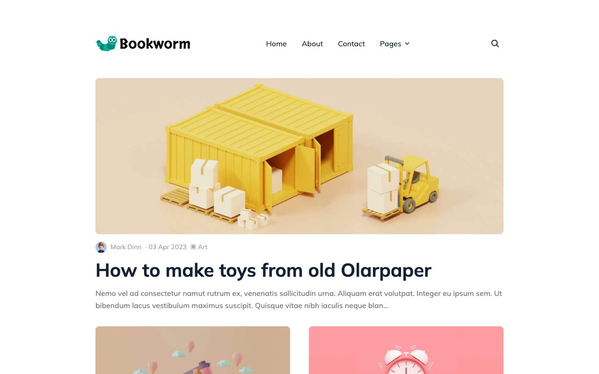

# Bookworm Light — Minimal Typography-Focused Blog Theme Clone (HTML/CSS/JS)

[](./demo.mp4)

A pixel-faithful, self-contained clone of the [Bookworm Light Next.js theme](https://themefisher.com/demo?theme=bookworm-light-nextjs) by Themefisher, rebuilt as static HTML, CSS, and vanilla JS with no build step. It's a minimal, typography-driven personal blog template with a light color scheme and teal accent, a sticky header featuring a dropdown "Pages" menu and search modal, a masonry-style post feed (one featured post plus a two-column grid), a dark footer, and supporting pages for authors, categories, tags, an "Elements" markdown style guide, a contact form, and single-post templates with tag pills, social share icons, and a "Similar Posts" section. Generated with Claude Fable 5.

## Pages

| File | Description |
|---|---|
| `index.html` | Home — featured post + two-column post grid with pagination |
| `about.html` | About — portrait image, headline, social icons, bio copy |
| `contact.html` | Contact — name/email/subject/message form |
| `authors.html` | Author cards grid |
| `authors-john-doe.html`, `authors-mark-dinn.html` | Per-author detail pages listing that author's posts |
| `categories.html` | Pill links to category detail pages |
| `categories-accessories.html`, `categories-art.html`, `categories-development.html`, `categories-food.html`, `categories-lifestyle.html` | Per-category post listings |
| `tags.html` | Pill links for post tags |
| `elements.html` | Markdown style guide — headings, lists, code blocks, blockquote, tables |
| `privacy-policy.html` | Privacy policy copy |
| `post-1.html`, `post-3.html`, `post-4.html`, `post-7.html` | Single post template with tags, share icons, "Similar Posts" grid |

## Style

- **Palette**: teal primary (`#01ad9f`) accents on a white/light-gray (`#ffffff` / `#fafafa`) background, with a dark navy (`#152035`) footer
- **Font**: Mulish (weights 400, 500, 600, 700, 800) via Google Fonts
- **Cards & inputs**: 8px card/image radius, 4–8px input/dropdown radius, soft dropdown shadow
- **Interactions**: sticky header, checkbox-driven mobile nav toggle, color/background hover transitions on nav dropdown and social icons, post card image opacity fade on hover

## Run

No build step required — this is plain static HTML/CSS/JS. Serve it locally or open the files directly:

```sh
python3 -m http.server 8080
# then open http://localhost:8080/index.html
```

or simply open `index.html` in a browser.

## Verify

There is no automated verify/test script in this project; check visually against `demo.mp4` and the reference at the URL in `prompt.md`.

`prompt.md` holds the full build spec (palette, type scale, layout breakdown per page), and `demo.mp4` shows the clone in motion.

## Credits

Faithful clone of an existing design, recreated for study/learning. All credit for the original design goes to its creators.

**Original:** Themefisher — <https://themefisher.com/demo?theme=bookworm-light-nextjs>

---

Part of the [Themefisher](../) collection in [templates/premium](../../), part of the [Templates](../../../) collection in the [claude-directory](../../../../) — an open-source gallery of AI-generated UI built with Claude Fable 5. [Browse the live gallery](https://pulkitxm.com/claude-directory).
