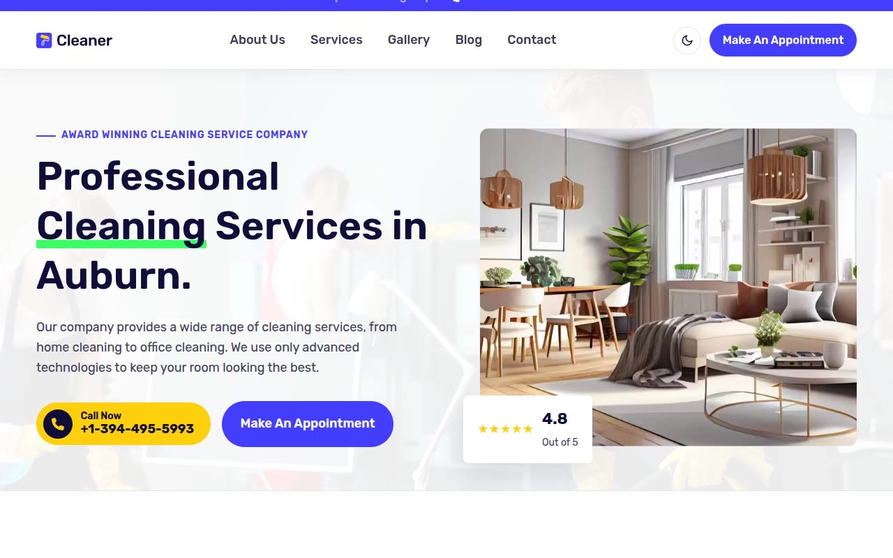

# Cleaner — Cleaning Service Marketing Template Clone (Vanilla HTML/CSS/JS)

[](./demo.mp4)

Cleaner is a marketing site for a residential/commercial cleaning service company ("Auburn Cleaning Co."), rebuilt pixel-faithfully as an 18-page, self-contained static clone of the Themefisher Next.js template with no framework and no build step. It reproduces the indigo/yellow/neon-green palette, Rubik typography, AOS scroll/entrance reveals, Swiper testimonial carousels, FAQ/elements accordions and tabs, a sticky announcement bar, and hover-lift cards — plus a light/dark theme toggle (driven by CSS custom properties and honoring `prefers-color-scheme`) added since the source template has no dark mode. Generated with Claude Fable 5.

## Pages

Home (`index.html`), About, Services (listing plus 4 detail pages — Floor Cleaning, Home Cleaning, Pest Control, Window Cleaning), Gallery, Blog (listing plus 6 post pages `blog-1.html`–`blog-6.html`), Contact, Appointment booking, and Elements (an internal style-guide/kitchen-sink page with headings, buttons, tabs, accordion, table, and embeds). All 18 pages share the same header (announcement bar, nav, "Make an Appointment" CTA, mobile hamburger menu) and footer chrome.

## Run

This is plain HTML/CSS/vanilla JS — there is no `package.json` and no build step. Serve the folder with any static file server from the project root:

```sh
python3 -m http.server
```

Then open `http://localhost:8000/` (or `index.html` directly) in a browser.

## Notes

- The light/dark theme toggle in the header persists the user's choice and honors `prefers-color-scheme`; design tokens live in `assets/css/tokens.css` and toggle logic in `assets/js/common.js`.
- All assets — fonts, hero/service/blog/team images, icons, and logos — are vendored locally under `assets/` so the site runs fully offline.
- `prompt.md` contains the full build spec — color tokens, typography scale, layout breakdown per page, and the interactions (AOS reveals, Swiper carousels, accordions/tabs) reproduced here.
- `demo.mp4` (with `poster.jpg` as its thumbnail) shows the site in motion, including scroll-reveal animations and the theme toggle.

## Credits

Faithful clone of an existing design, recreated for study/learning. All credit for the original design goes to its creators.

**Original:** Themefisher — <https://themefisher.com/demo?theme=cleaner-nextjs>

---

Part of the [Templates](../) collection in the [claude-directory](../../) — an open-source gallery of AI-generated UI built with Claude Fable 5. [Browse the live gallery](https://pulkitxm.com/claude-directory).
