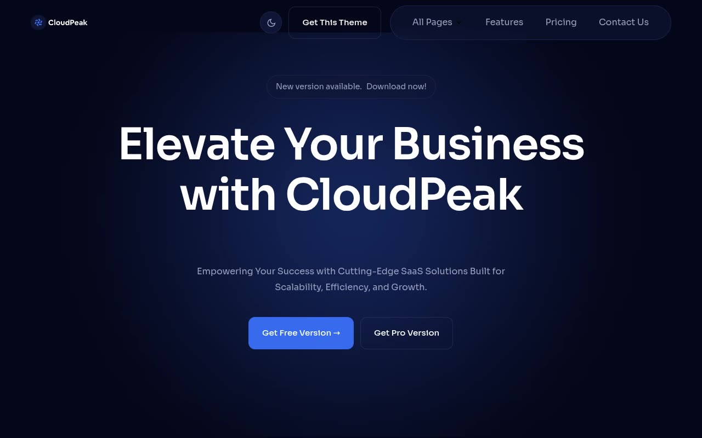

# CloudPeak — Cloud Finance & Business SaaS Marketing Template Clone (Vanilla HTML/CSS/JS)

[](./demo.mp4)

CloudPeak is a dark, fintech/SaaS marketing template for a cloud finance and business platform product, rebuilt pixel-faithfully as a 32-page, self-contained static clone with no framework and no build step. It reproduces the deep-navy base palette (`#05071a`) with an electric-blue primary accent (`#376aed`) and a green secondary accent (`#47cc88`), Sora typography, radial glow art behind the hero and CTA sections, AOS-style scroll-entrance animations, a click-to-expand FAQ accordion, a Monthly/Yearly pricing toggle, and hover-state transitions on buttons and cards — including a light/dark theme toggle (persisted to `localStorage`, honoring `prefers-color-scheme`) that was added for this clone since the source template only ships dark mode. Generated with Claude Fable 5.

## Pages

Home, Features, Pricing (with Monthly/Yearly toggle and full plan-comparison table), About (core values, journey milestones, team grid), Integration (9 app integrations), Changelog, Contact, Book a Free Demo, Elements (component kitchen sink), Blog index plus 8 individual post pages, 4 blog category filter pages (Business, Company, Guides, Technology), Case Studies index plus 6 individual case-study pages, Privacy Policy, Terms & Conditions, and a custom 404 page. All pages share the same header/footer chrome and design tokens (`assets/css/tokens.css`, `assets/css/base.css`).

## Run

This is plain HTML/CSS/vanilla JS — there is no `package.json` and no build step. Serve the folder with any static file server from the project root:

```sh
python3 -m http.server
```

Then open `http://localhost:8000/` (or `index.html` directly) in a browser.

## Notes

- `prompt.md` contains the full build spec — color tokens, typography scale, motion/keyframe details, and the complete page-by-page layout breakdown used to build this clone.
- `demo.mp4` (with `poster.jpg` as its thumbnail) shows the site in motion, including scroll-reveal animations, the FAQ accordion, and the pricing toggle.
- Assets (fonts, images, logo) live under `assets/`; shared JS behavior (theme toggle, mobile nav, accordion, pricing switch, scroll reveal) lives in `assets/js/common.js`.

## Credits

Faithful clone of an existing design, recreated for study/learning. All credit for the original design goes to its creators.

**Original:** Themefisher — CloudPeak (Next.js) — <https://themefisher.com/demo?theme=cloudpeak-nextjs>

---

Part of the [Templates](../) collection in the [claude-directory](../../) — an open-source gallery of AI-generated UI built with Claude Fable 5. [Browse the live gallery](https://pulkitxm.com/claude-directory).
