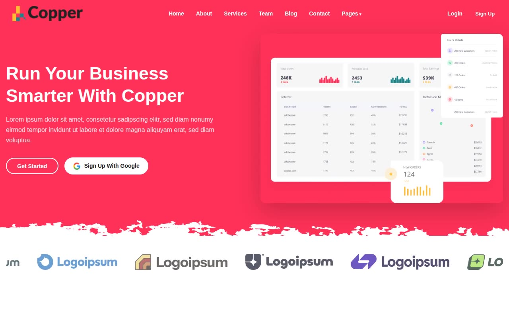

# Copper NextJS — Business SaaS Landing Page Website Template Clone (Vanilla HTML + CSS + JS)

[](./demo.mp4)

A pixel-faithful static clone of the Copper NextJS premium SaaS/business marketing template by Themefisher, rebuilt as plain HTML + CSS + vanilla JavaScript with no build step required. The clone reproduces all 12 pages — Home, About, Services, Pricing, Contact, Team, Blog, Blog Post, FAQ, Career, How It Works, and Testimonials — along with every interaction: sticky transparent navbar with mobile hamburger menu, dropdown navigation, brand logo marquee carousel, feature tabs, FAQ accordions, monthly/annual pricing toggle, and scroll-entrance animations via a custom IntersectionObserver. Decorative brushstroke SVG dividers separate sections throughout, and the design uses the Quicksand typeface with a red-pink primary accent (`#FF3158`). The stack is vanilla HTML, a single `styles.css`, and inline vanilla JavaScript — all assets including fonts and images are vendored locally so the site runs fully offline. Generated with Claude Fable 5.

## Run

No build step is needed. Open any HTML file directly in your browser, or serve the folder with Python to get correct relative-path resolution across pages:

```sh
python3 -m http.server
```

Then open `http://localhost:8000` in your browser. The entry point is `index.html`.

## Pages

| File | Page |
|---|---|
| `index.html` | Home |
| `about.html` | About |
| `services.html` | Services |
| `pricing.html` | Pricing |
| `contact.html` | Contact |
| `team.html` | Team |
| `blog.html` | Blog |
| `blog-post.html` | Blog Post |
| `faq.html` | FAQ |
| `career.html` | Career |
| `how-it-works.html` | How It Works |
| `testimonial.html` | Testimonials |

## Source

`prompt.md` holds the full build specification — palette, typography, layout details, and per-page structure. `demo.mp4` shows the clone in motion.

## Credits

Faithful clone of an existing design, recreated for study/learning. All credit for the original design goes to its creators.

**Original:** Themefisher — <https://themefisher.com/demo?theme=copper-nextjs>

---

Part of the [Themefisher](../) collection in the [claude-directory](../../../../) — an open-source gallery of AI-generated UI built with Claude Fable 5. [Browse the live gallery](https://pulkitxm.com/claude-directory).
