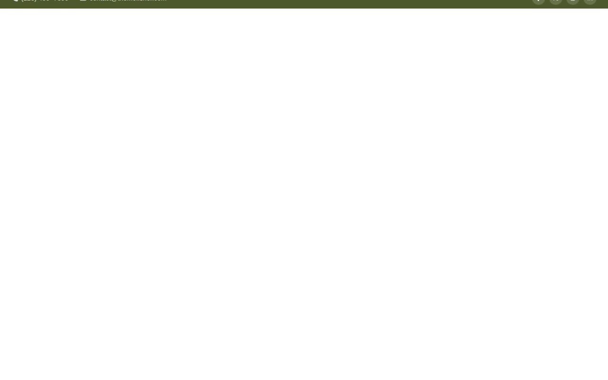

# Cuisine — Food & Restaurant Website Template Clone (Vanilla HTML/CSS/JS + AOS + Swiper)

[](./demo.mp4)

A pixel-faithful, self-contained clone of the Cuisine food and restaurant marketing template by Themefisher, rebuilt as plain HTML, CSS, and vanilla JavaScript with no build step required. The template features an olive green (`#4d592b`) and vibrant orange (`#ec5600`) accent palette, Playfair Display serif headings paired with DM Sans body text, AOS scroll-entrance animations, a Swiper testimonials carousel, a sticky header, and a filterable menu grid with shuffle animation. It spans ten fully linked pages suited to any restaurant or food-service website, and all assets — images, icons, and fonts — are vendored locally so the project runs entirely offline. Generated with Claude Fable 5.

## Pages

| File | Page |
|---|---|
| `index.html` | Home |
| `about.html` | About Us |
| `menu.html` | Menu (filter tabs: All / Breakfast / Snaks) |
| `blog.html` | Blog listing with sidebar, search, and pagination |
| `blog-the-secret-tip.html` | Blog post — The Secret Tip |
| `blog-gadgets.html` | Blog post — Gadgets |
| `blog-baking.html` | Blog post — Baking |
| `contact.html` | Contact with form and info cards |
| `book.html` | Book a Table with booking form |
| `elements.html` | Elements (typography, buttons, forms, accordions, modals) |
| `privacy-policy.html` | Privacy Policy |
| `terms-and-conditions.html` | Terms and Conditions |

## Run

No build step is needed. Open `index.html` directly in a browser, or serve the folder with any static file server. For the smoothest experience (avoids cross-origin asset issues):

```sh
python3 -m http.server 8080
```

Then open <http://localhost:8080> in your browser.

## Notable techniques

- **AOS (Animate on Scroll)** and **Swiper.js** loaded from CDN — no local bundling required.
- **Menu filter/shuffle** — pill tab buttons filter food cards with a CSS transition animation.
- **Sticky header** — slides in with a 0.5 s ease transition on scroll.
- **Button hover fill** — circular expanding fill originating from the bottom-right corner (550 ms transition).
- **Icon hover on menu cards** — icon tiles slide out/in on the Y axis (500 ms / 300 ms).
- **Typography** — DM Sans (weights 400, 600, 700) and Playfair Display (weights 400, 500, 700) loaded via Google Fonts `<link>`.
- All assets are vendored under `assets/` so the project works offline after the initial Google Fonts load.

`prompt.md` contains the full build specification. `demo.mp4` shows the finished template in motion.

## Credits

Faithful clone of an existing design, recreated for study/learning. All credit for the original design goes to its creators.

**Original:** Themefisher — <https://themefisher.com/demo?theme=cuisine-nextjs>

---

Part of the [Themefisher](../) collection in the [claude-directory](../../../../) — an open-source gallery of AI-generated UI built with Claude Fable 5. [Browse the live gallery](https://pulkitxm.com/claude-directory).
