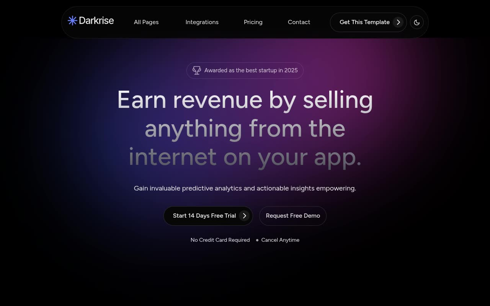

# Darkrise — Analytics/SaaS Dashboard Marketing Template Clone (Vanilla HTML/CSS/JS)

[](./demo.mp4)

Darkrise is a dark-theme SaaS/startup marketing template for an analytics and dashboard product, rebuilt pixel-faithfully as a 29-page, self-contained static clone with no framework and no build step. It reproduces the near-black base palette with a cobalt-blue accent, blue-to-pink gradient glow art behind the hero and CTA sections, Figtree typography, AOS-style scroll-entrance animations, marquee/rotate decorative keyframes, and hover state transitions on buttons and cards — including a light/dark theme toggle (persisted to `localStorage`, honoring `prefers-color-scheme`) that was added for this clone since the source template only ships dark mode. Generated with Claude Fable 5.

## Pages

Home, Elements, About, Pricing (with monthly/yearly toggle and feature-comparison table), Integrations index plus 9 integration detail pages (Intercom, Hubspot ×2, Kickstarter, Mailchimp, Shopify ×2, Slack, Zapier), Feature, Blog index (paginated) plus 8 blog post templates, Changelog, Contact, Terms & Conditions, Privacy Policy, and a custom 404 page. All pages share the same header/footer chrome (`partials/header.html`, `partials/footer.html`) and design tokens.

## Run

This is plain HTML/CSS/vanilla JS — there is no `package.json` and no build step. Serve the folder with any static file server from the project root:

```sh
python3 -m http.server
```

Then open `http://localhost:8000/` (or `index.html` directly) in a browser.

## Notes

- `prompt.md` contains the full build spec — color tokens, typography scale, motion/keyframe details, and the complete page-by-page layout breakdown used to build this clone.
- `demo.mp4` (with `poster.jpg` as its thumbnail) shows the site in motion, including scroll-reveal animations and the pricing toggle.
- Assets (fonts, images, CSS, JS) live under `assets/`; shared header/footer markup lives under `partials/`.

## Credits

Faithful clone of an existing design, recreated for study/learning. All credit for the original design goes to its creators.

**Original:** Themefisher — Darkrise (Next.js) — <https://themefisher.com/demo?theme=darkrise-nextjs>

---

Part of the [Templates](../) collection in the [claude-directory](../../) — an open-source gallery of AI-generated UI built with Claude Fable 5. [Browse the live gallery](https://pulkitxm.com/claude-directory).
