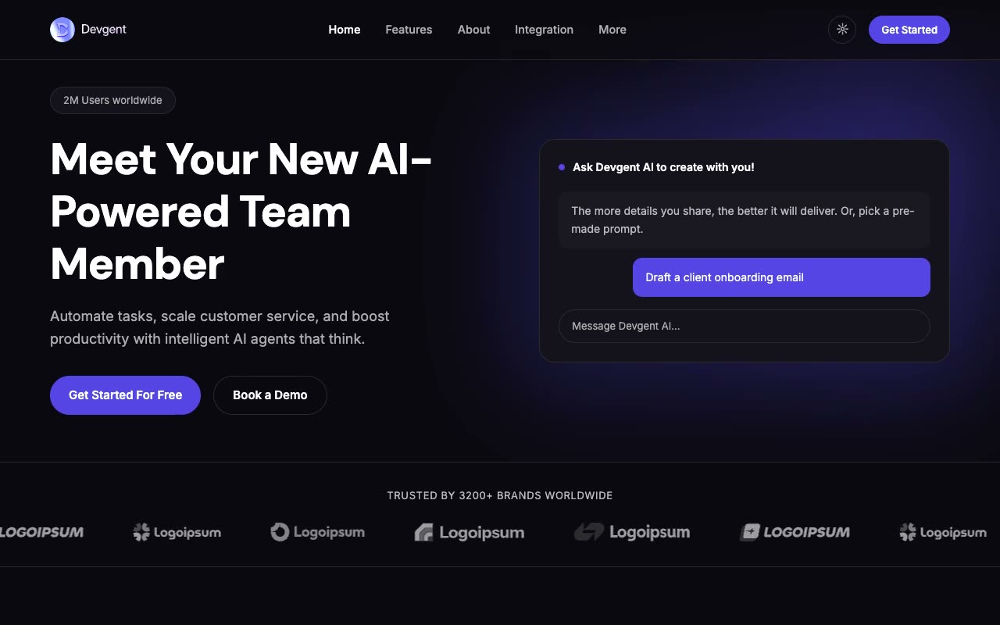

# Devgent — AI Chat Assistant SaaS Template

[](./demo.mp4)

Pixel-faithful reproduction of the Devgent Next.js AI-assistant SaaS template by ThemeFisher, rebuilt as a self-contained plain HTML/CSS/JS project with no build step required. The design is dark-first, with a deep near-black base (`#0a0910`), an indigo-purple accent (`#5545e6`), glassy rounded surfaces, and a gradient glow behind the hero's chat-UI mockup. Inter handles body copy and DM Sans drives display headings. The project ships 16 complete pages — home, about, features, integration, an integration detail page, pricing, blog, a blog post, a blog category page, an author page, career, changelog, contact, terms, privacy policy, and a 404 — all sharing a single `assets/css/tokens.css` + `assets/css/styles.css` design system and `assets/js/main.js`.

## Run

No build step required. Open any page directly in a browser:

```
open index.html
```

Or serve the folder over HTTP (recommended, so relative paths resolve correctly):

```sh
cd templates/premium/themefisher/devgent-nextjs
python3 -m http.server
# then visit http://localhost:8000
```

## Pages

| File | Page |
|---|---|
| `index.html` | Home |
| `about.html` | About |
| `features.html` | Features |
| `integration.html` | Integrations |
| `integration/crypto-safe.html` | Integration Detail — CryptoSafe |
| `pricing.html` | Pricing |
| `blog.html` | Blog |
| `blog/post-3.html` | Blog Post Detail |
| `categories/ai.html` | Blog Category — AI |
| `authors/ethan-williams.html` | Author Profile |
| `career.html` | Career |
| `changelog.html` | Changelog |
| `contact.html` | Contact |
| `terms.html` | Terms & Conditions |
| `privacy-policy.html` | Privacy Policy |
| `404.html` | Not Found |

## Notable techniques

- **CSS custom properties design system** — `assets/css/tokens.css` defines colour, radius, and easing tokens once; `assets/css/styles.css` consumes them across all 16 pages from a single source of truth.
- **Dark-first theming with an explicit light override** — the site defaults to the source design's dark palette, but a `data-theme` attribute driven by the header toggle button swaps every token to a light variant, persisted via `localStorage`.
- **Chat-UI hero mockup** — the hero renders a self-contained "product" card with a glow backdrop, simulated chat bubbles, and an input bar, matching the animated assistant preview from the source.
- **Tabbed feature explorer** — the "What makes our AI chat stand out?" section swaps four feature panels (Meeting Assistant, Knowledge Base, Customer Support, Task Automation) via a pill tab bar.
- **Alternating numbered steps** — the "How our AI chat works" section lays out four steps in bordered rows with a large numeral watermark per row.
- **Pricing toggle** — `pricing.html` (and the home pricing section) includes a monthly/yearly billing switch that rewrites each plan's price and period label via JavaScript.
- **FAQ accordion** — collapsible answer panels with CSS `max-height` transitions; only one item stays open at a time.
- **Testimonial carousel** — a simple prev/next controlled carousel cycles through customer quotes.
- **Logo marquee** — the "Trusted by 3200+ brands" strip loops via a pure CSS `@keyframes` translate animation.
- **Changelog timeline** — `changelog.html` renders a version/date/badge timeline with bulleted release notes per entry.
- **Mobile hamburger nav** — a three-bar toggle reveals a stacked mobile nav panel beneath the sticky header.

`prompt.md` holds the full visual specification and `demo.mp4` shows the template in motion.

## Tech stack

- Vanilla HTML5, CSS3, JavaScript (ES6+) — zero dependencies, zero build step
- [Inter](https://fonts.google.com/specimen/Inter) — body font, vendored locally
- [DM Sans](https://fonts.google.com/specimen/DM+Sans) — display/heading font, vendored locally
- All images vendored locally under `assets/images/`

## Credits

Faithful clone of an existing design, recreated for study/learning. All credit for the original design goes to its creators.

**Original:** Themefisher — <https://themefisher.com/demo?theme=devgent-nextjs>
