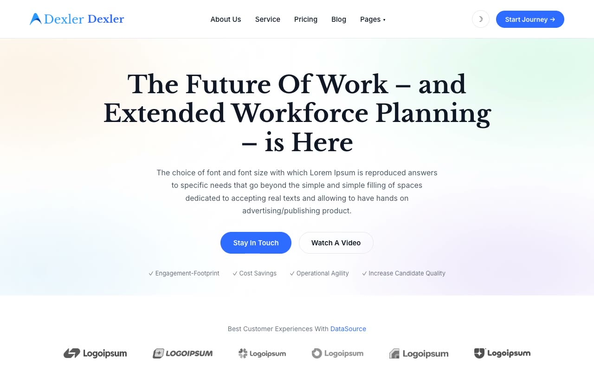

# Dexler — HR / Workforce-Management SaaS Landing Template (Vanilla HTML/CSS/JS)

[](./demo.mp4)

Pixel-faithful reproduction of the Themefisher "Dexler" Next.js template, rebuilt as a self-contained, build-free HTML/CSS/JS project. Dexler is a clean, light, corporate HR/workforce-management SaaS landing site built around soft pastel gradient blobs behind white sections, a serif display headline font paired with Inter body text, fully rounded pill buttons, scroll-reveal fade-up animations, a testimonial carousel, and a dark footer. The clone ships 11 top-level pages plus a blog-post detail template, all sharing one header, footer, and stylesheet. Generated with Claude Fable 5.

## Run

No build step required. Open any page directly in a browser:

```sh
open index.html
```

Or serve the folder over HTTP (recommended, so relative asset paths resolve correctly):

```sh
cd templates/premium/themefisher/dexler-nextjs
python3 -m http.server
# then visit http://localhost:8000
```

## Pages

| File | Page |
|---|---|
| `index.html` | Home |
| `about.html` | About |
| `service.html` | Service |
| `pricing.html` | Pricing |
| `blog.html` | Blog |
| `blog/post-1.html` | Blog Post Detail |
| `careers.html` | Careers |
| `how-it-works.html` | How It Works |
| `team.html` | Team |
| `elements.html` | Elements (UI kit / style guide) |
| `contact.html` | Contact |
| `terms-and-conditions.html` | Terms and Conditions |

## Notable techniques

- **Shared header/footer across all 12 pages** — a sticky header with an "About Us / Service / Pricing / Blog / Pages" nav (Pages dropdown links to Careers, How It Works, Team, Elements, Terms and Conditions) and a dark footer with quick links, support links, contact info, and social icons.
- **Pastel gradient-blob backgrounds** — large blurred mint, lavender, peach, and sky decorative shapes sit behind alternating white sections.
- **Serif + sans type pairing** — headlines use a serif display face, body/UI copy uses Inter, both vendored locally.
- **Scroll-reveal animation** — sections fade up (opacity + translateY) on scroll entry, staggered per card.
- **Testimonial carousel** — dot-paginated slide/fade carousel on the home page.
- **Mobile hamburger nav** — the header collapses to a slide/fade mobile menu on small screens.
- **Pricing toggle & FAQ accordion** — `pricing.html` includes a monthly/yearly billing switch and an FAQ accordion.

`prompt.md` holds the full visual specification and `demo.mp4` shows the template in motion.

## Tech stack

- Vanilla HTML5, CSS3, JavaScript — zero dependencies, zero build step
- Fonts vendored locally under `assets/fonts/`
- Images vendored locally under `assets/images/`

## Credits

Faithful clone of an existing design, recreated for study/learning. All credit for the original design goes to its creators.

**Original:** Themefisher — <https://themefisher.com/demo?theme=dexler-nextjs>

---

Part of the [Templates](../../../) collection in the [claude-directory](../../../../) — an open-source gallery of AI-generated UI built with Claude Fable 5. [Browse the live gallery](https://pulkitxm.com/claude-directory).
