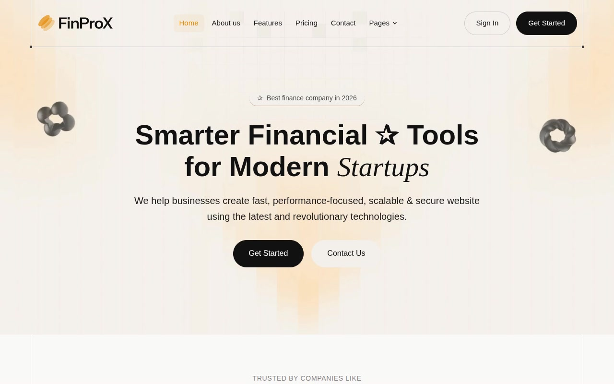

# FinProx — Financial SaaS Landing Page Template Clone (Vanilla HTML + CSS + JS)

[](./demo.mp4)

Pixel-faithful clone of the Themefisher "FinProx NextJS" template, rebuilt as plain HTML, CSS, and vanilla JavaScript with no build step required. The design targets financial SaaS products with a clean editorial aesthetic: amber/orange primary (`#e48800`), warm off-white backgrounds (`#faf9f8`), and Instrument Sans + Instrument Serif typography. Across 19 pages the template covers every surface a financial SaaS marketing site needs — from home and pricing to blog, case studies, careers, changelog, integrations, and legal pages — with scroll-reveal entrance animations, a testimonial carousel, pricing toggle, accordion FAQ, tabbed content sections, sticky mega-nav with dropdowns, mobile hamburger menu, and an integration filter grid. Generated with Claude Fable 5.

## Pages

| File | Page |
|---|---|
| `index.html` | Home |
| `about.html` | About |
| `features.html` | Features |
| `pricing.html` | Pricing |
| `contact.html` | Contact |
| `blog.html` | Blog list |
| `blog-single.html` | Blog article |
| `case-studies.html` | Case studies list |
| `case-study-single.html` | Case study article |
| `careers.html` | Careers list |
| `careers-single.html` | Job detail + apply form |
| `changelog.html` | Changelog |
| `integrations.html` | Integrations grid |
| `signin.html` | Sign in |
| `signup.html` | Sign up |
| `elements.html` | Component library |
| `terms-of-service.html` | Terms of service |
| `privacy-policy.html` | Privacy policy |
| `404.html` | 404 error |

## Run

No build step is required. Open `index.html` directly in a browser, or serve the project folder with any static file server:

```sh
python3 -m http.server
```

Then visit `http://localhost:8000` in your browser.

All assets (images, icons) are vendored locally under `assets/`. Fonts are loaded from the Google Fonts CDN.

## Notes

- Layout uses a `.main-container` wrapper at 90% width with side borders and decorative dark corner dots at the bottom.
- Scroll-reveal entrance animations are driven by `IntersectionObserver` (no external AOS library).
- The pricing page includes a monthly/annual billing toggle that swaps displayed prices client-side.
- The integrations page includes a category filter that shows/hides integration cards.
- `prompt.md` holds the full build specification used to generate this clone.
- `demo.mp4` shows the finished result in motion.

## Credits

Faithful clone of an existing design, recreated for study/learning. All credit for the original design goes to its creators.

**Original:** Themefisher — https://themefisher.com/demo?theme=finprox-nextjs

---

Part of the [Templates](../) collection in the [claude-directory](../../) — an open-source gallery of AI-generated UI built with Claude Fable 5. [Browse the live gallery](https://pulkitxm.com/claude-directory).
